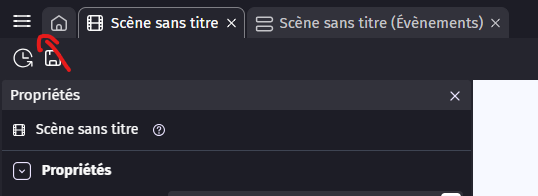
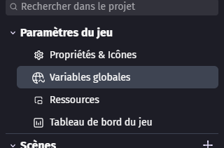
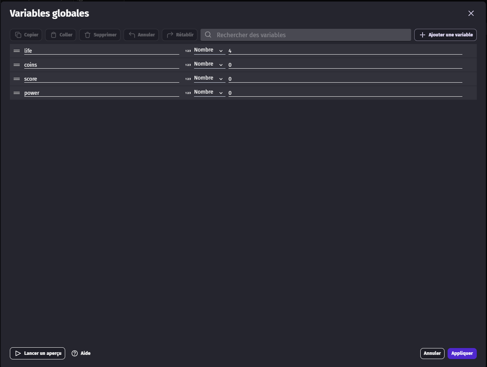
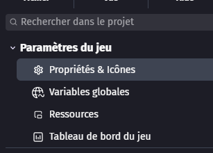
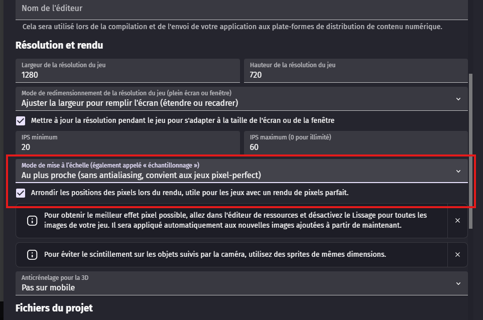

# Setup

## Ajouter les variables globales

Dans un premier temps, nous allons ajouter les variables globales.

Pour cela, cliquez sur les trois petits traits en haut à gauche.

Puis cliquez sur "variable globale".

Créez ensuite les variables suivantes :

| Column 1 | Column 2 | Column 3 |
|:---------|:--------:|---------:|
| life     |  nombre  |        4 |
| coins    |  nombre  |        0 |
| score    |  nombre  |        0 |
| power    |  nombre  |        0 |

Puis cliquez sur "Appliquer" en bas à droite.

## Activer le pixel art

Nous allons activer le mode pixel art afin que toutes nos textures ne soient pas floues.

Pour cela, cliquez sur les trois petits traits en haut à gauche.

Puis cliquez sur "Propriétés et icônes".

Descendez dans la sous-catégorie "Résolution et rendu", puis cochez "Arrondir les positions des pixels" et passez le mode de mise à l'échelle sur "au plus proche".

Puis cliquez sur "Appliquer" en bas à droite.
