# Monde

## Création de la tilemap

Pour gérer facilement un grand monde, nous allons utiliser ce qu'on appelle une tilemap.

Pour en créer une, cliquez sur le petit bouton "Ajouter un objet" qui se trouve à côté de "Objets de scène".

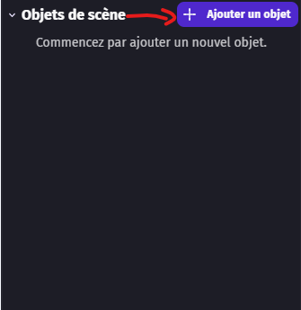

Puis sélectionnez "TileMap".

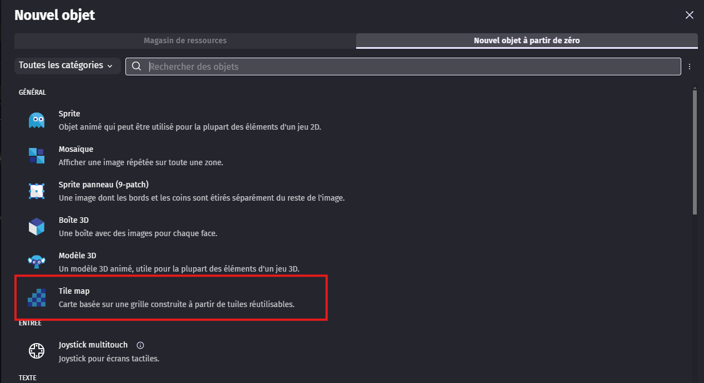

Cela ouvre le panneau de configuration.
Nommez notre objet "TileMap".
Mettez une taille de tuile à 32.
Cliquez ensuite sur "Choisir un fichier", sélectionnez "fichier depuis votre ordinateur", puis choisissez le fichier "island_tileset.png" qui se trouve dans le dossier "tileset" que vous avez téléchargé.

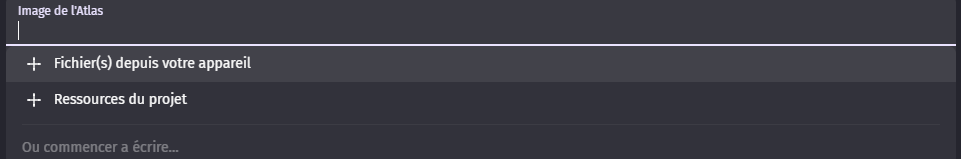
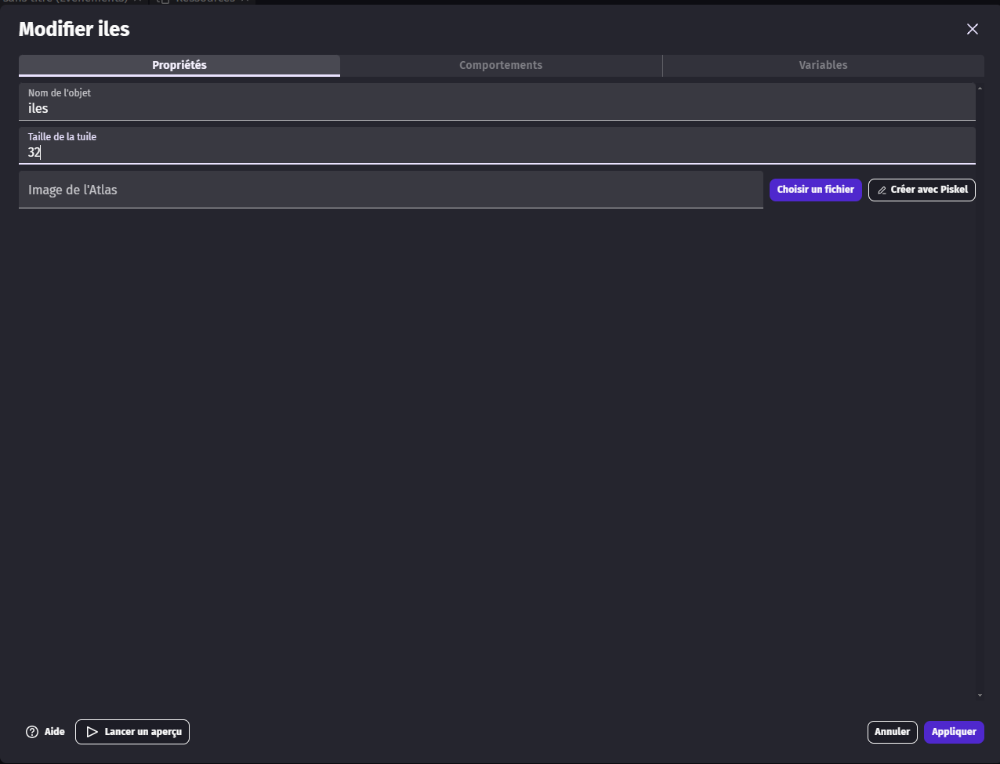
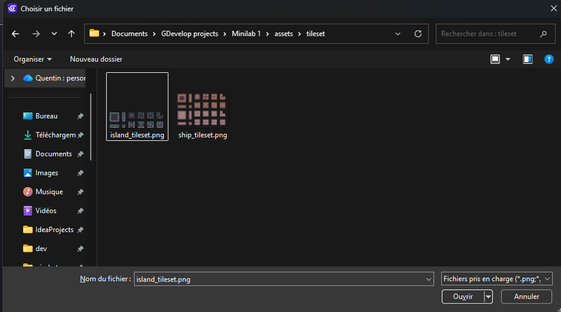

Ensuite, cliquez simplement sur les textures où vous souhaitez avoir des collisions.

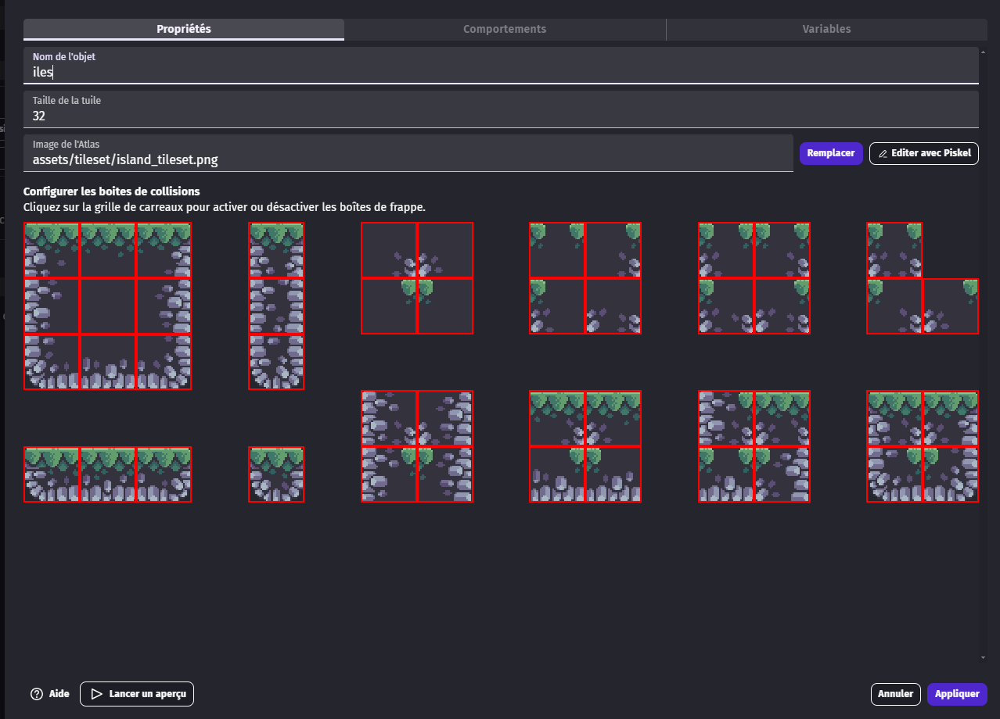

Enfin, cliquez sur "Comportement", puis sur "Ajouter un comportement".

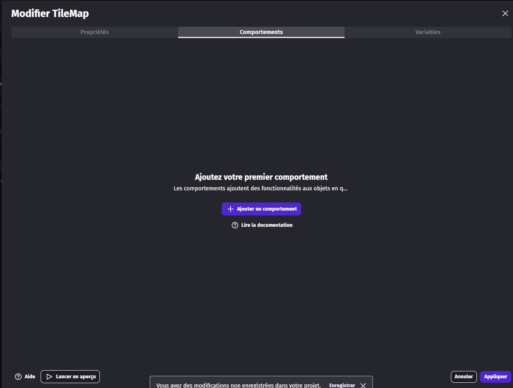

Sélectionnez ensuite "Plateforme".

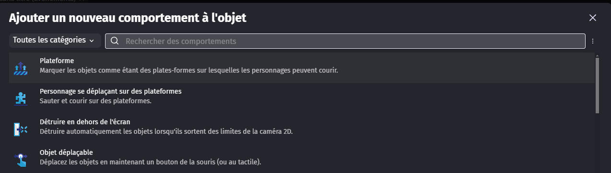

Puis revenez dans l'onglet "Propriété".

## Éditer le tileset

Le but est de changer les couleurs et d'ajouter de nouvelles textures dans le tileset afin de le personnaliser.

Pour cela, cliquez sur le bouton "éditer avec Piskel".

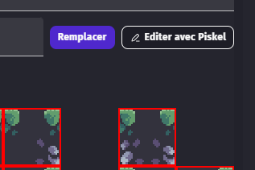

Vous pourrez alors modifier l'image pixel par pixel.

Attention, nos textures font 32 pixels par 32 pixels. Il faut donc créer des tuiles de ce format.
Si vous voulez créer des éléments plus grands, c'est possible. Il faudra simplement penser au fait qu'un même élément peut utiliser plusieurs tuiles.

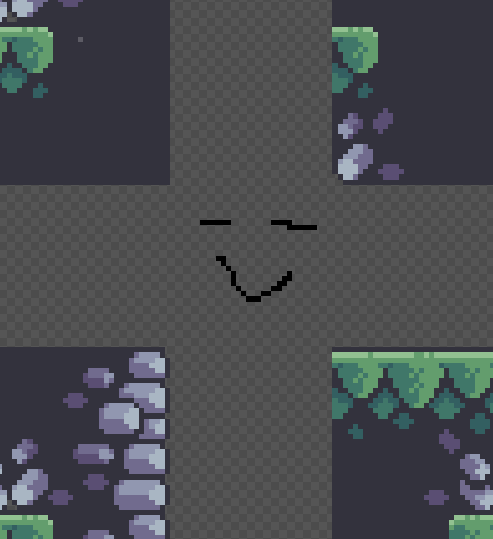

Pensez bien à sauvegarder.

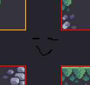

Une fois terminé, cliquez sur "Appliquer" pour enregistrer la tilemap.

## Commencer à dessiner

Premièrement, faites un clic droit sur l'objet que nous avons créé, puis cliquez sur "Définir comme objet global".

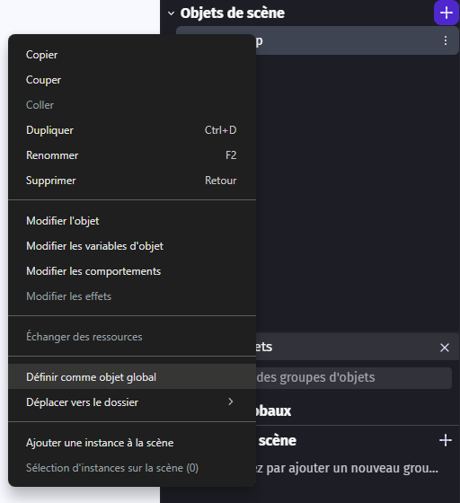

Cliquez ensuite sur "oui".

Cela nous permettra d'utiliser notre tilemap dans toutes les scènes.

Ensuite, il suffit de glisser-déposer la tilemap dans l'espace central.

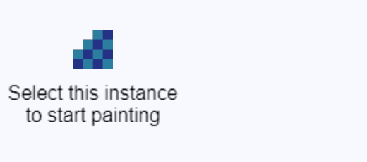

Vous pouvez ensuite sélectionner, sur le côté gauche, les tuiles que vous souhaitez dessiner.

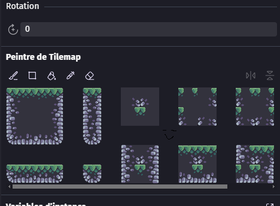

Nous pouvons maintenant dessiner le terrain en cliquant sur les tuiles de la tilemap que nous souhaitons utiliser, selon la profondeur voulue.

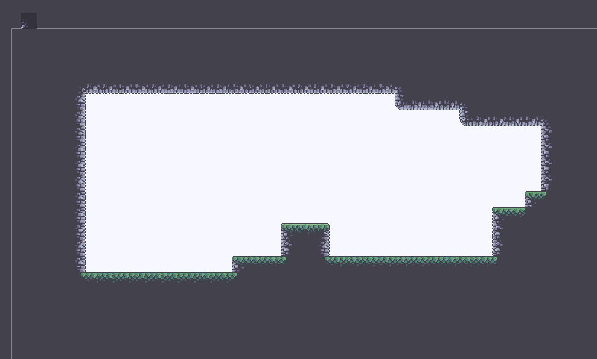

