# Personnage

## Ajout du personnage

Nous allons créer un nouvel objet. Cette fois-ci, nous allons choisir un sprite.

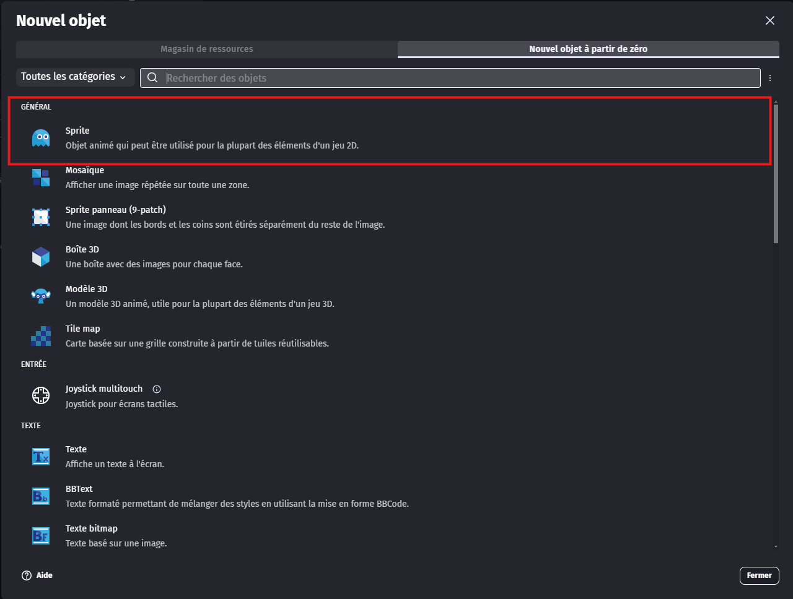

Nous allons l'appeler "joueur".

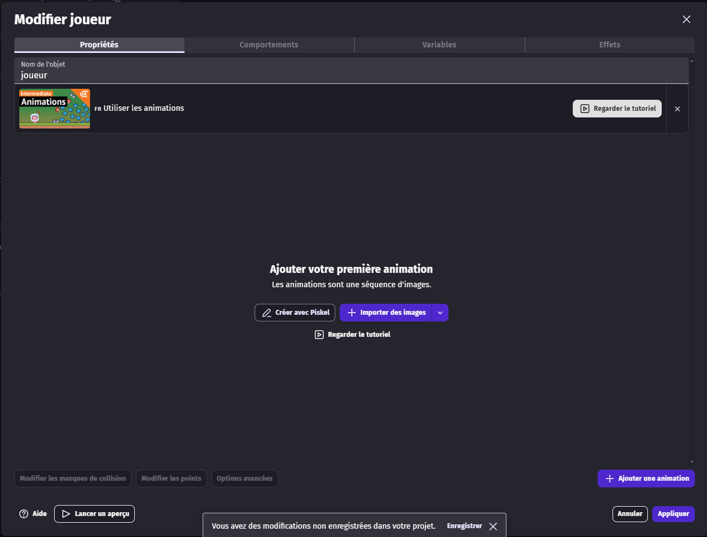

Nous allons ensuite ajouter toutes les animations dont nous aurons besoin pour ce personnage.

Pour le faire facilement, créez une nouvelle animation pour chaque action du personnage.

Voici ce que cela donne pour les animations de course. Il est important de les nommer comme ceci afin que ce soit plus
simple à utiliser plus tard. Il faut aussi bien cocher "en boucle".
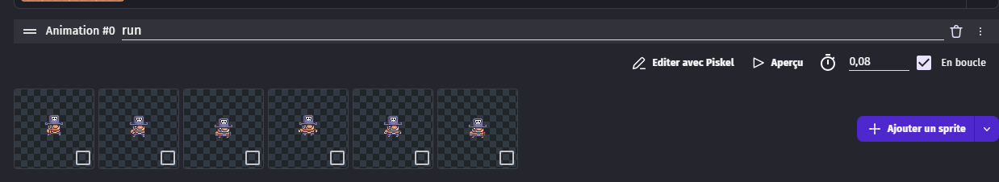

Nous allons faire la même chose pour les animations de saut, d'attente (idle) et de dégât (hit).

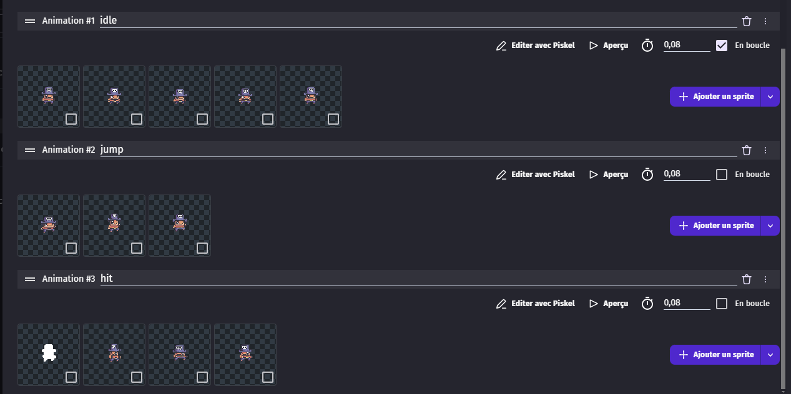

## Ajout des comportements

Dans l'onglet "Comportement", nous allons ajouter ces comportements :

- Santé (avec 3 points de vie de base, 3 points de vie maximum et un damage cooldown de 1,5)
- SmoothPlatformerCamera (cela ajoute le platformerObject)
- RemapForPlatformer

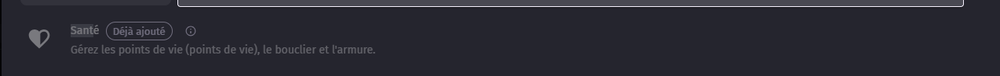
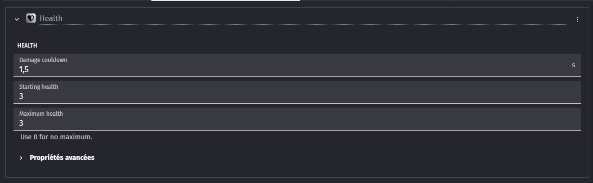

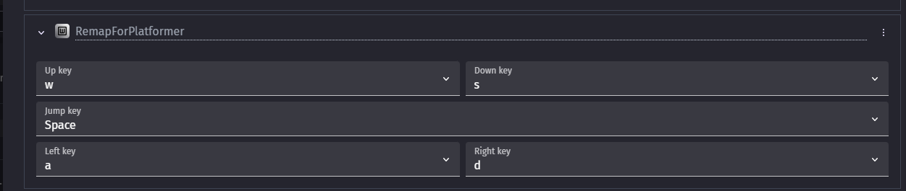

Voici la liste de tous les comportements que vous devez avoir.

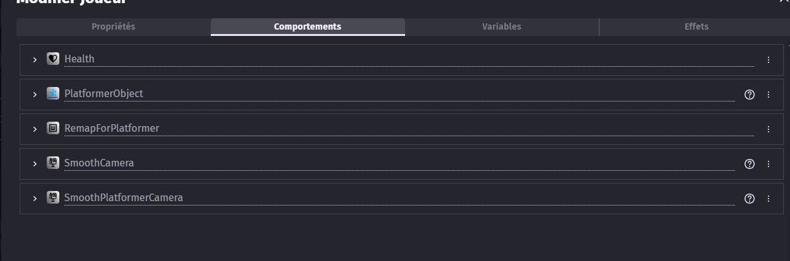

## Point

Il faut maintenant configurer le point où se trouvera l'épée quand le joueur attaquera.

Pour cela, cliquez sur le bouton "Modifier les points".

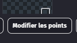

Puis ajoutez un nouveau point que nous allons appeler "sword" et placez-le à l'endroit où nous voulons que l'épée soit.

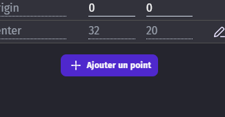

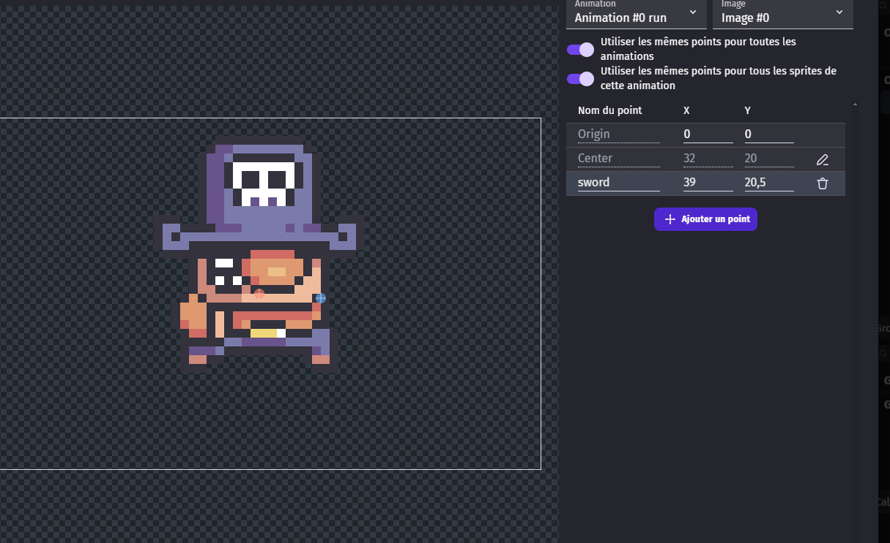

Ce point pourra être déplacé plus tard si l'épée n'est pas au bon endroit.

## Ajouter le joueur dans le monde

Maintenant, nous allons ajouter le joueur dans le monde.

En premier lieu, nous allons mettre le joueur en tant qu'objet global en faisant un clic droit dessus, puis en cliquant
sur "Définir comme objet global".

Pour cela, il suffit de glisser-déposer le joueur dans le monde, au-dessus de notre tilemap.

Maintenant, nous pouvons lancer le jeu afin de vérifier que tout fonctionne et voir s'il y a des paramètres à modifier.
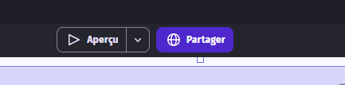
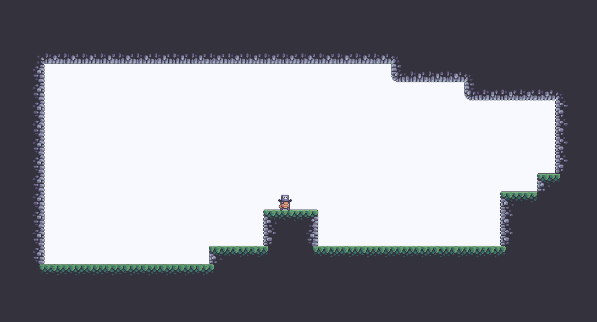

Nous pouvons voir que la caméra est trop éloignée.

Pour zoomer, nous allons aller dans l'onglet "Évènement".

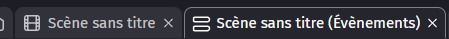

Puis nous allons créer un nouvel évènement.

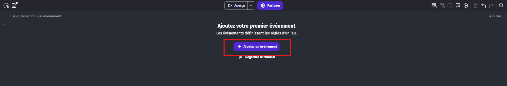

Nous allons laisser les conditions vides afin que l'action soit toujours activée. Nous allons ensuite ajouter l'action "
zoom de la caméra" en cliquant sur le bouton "Ajouter une action".

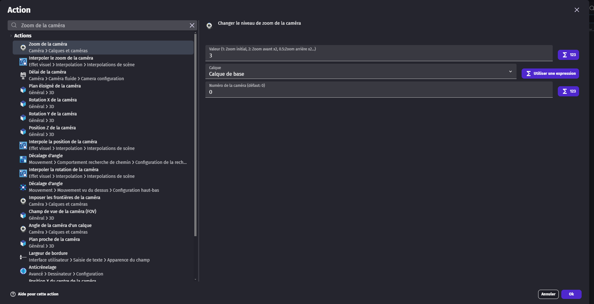
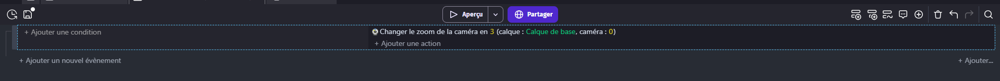

## Jouer les bonnes animations

Maintenant, nous allons faire en sorte que, si le joueur se déplace, les bonnes animations soient jouées.

Toujours dans "Évènement", créez un groupe d'évènements en faisant un clic droit sur "Ajouter un nouvel évènement".

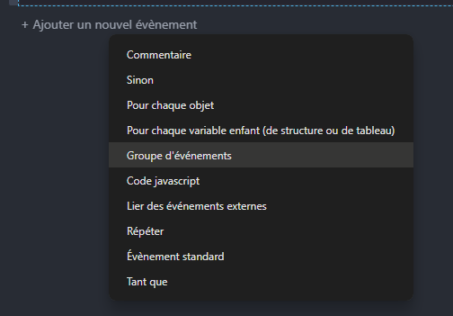

Appelez-le "Joueur".

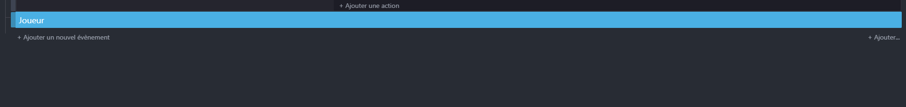

Ensuite, créez trois nouveaux évènements que nous glisserons dans le dossier que nous venons de créer.

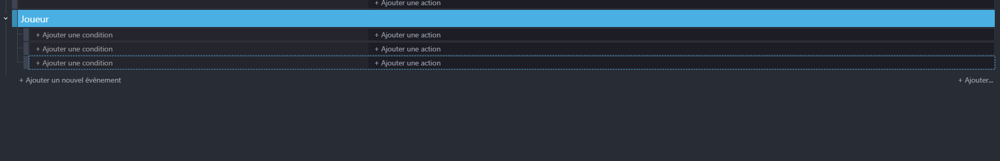

Dans le premier évènement, nous allons mettre comme condition que si la vitesse de déplacement est "égale à" 0, alors
nous appliquons au joueur l'animation idle.

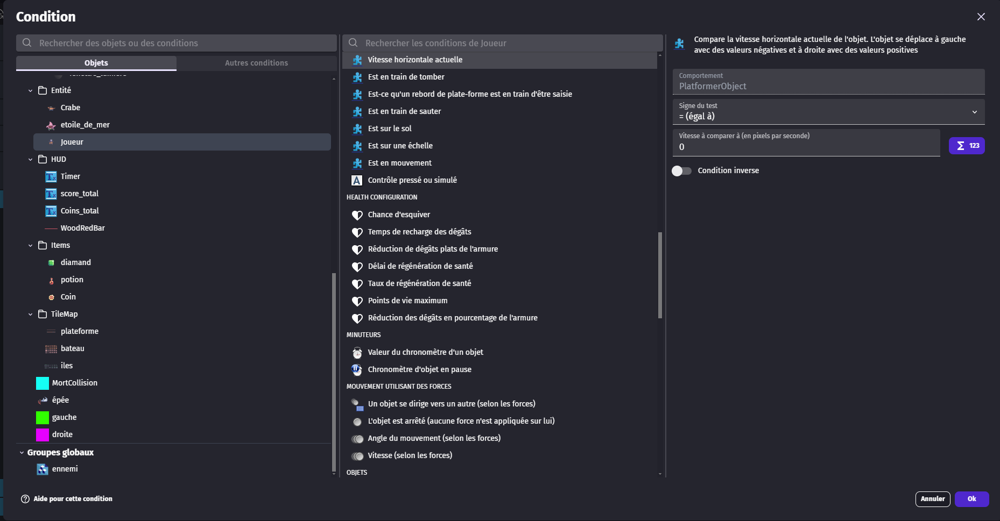

Pour l'action, cliquez sur "utiliser une expression".

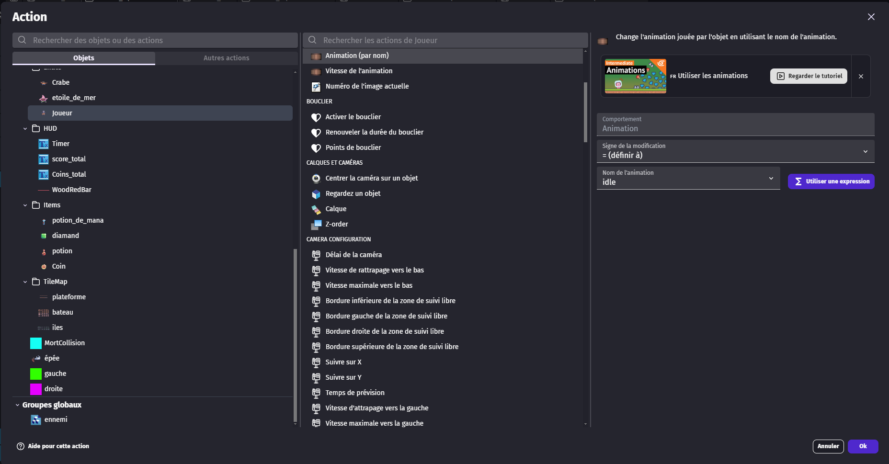

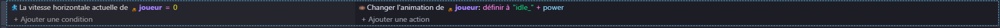

Dans les deux autres évènements, ce sera presque identique, mais nous vérifierons si la vitesse est supérieure à 0 ou
inférieure à 0.

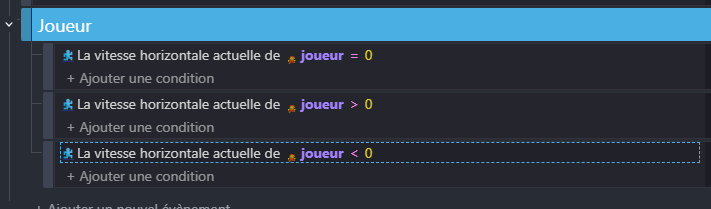

Nous allons leur mettre comme action le changement d'animation sur "run".

Enfin, nous allons ajouter une deuxième action : le retournement du joueur.
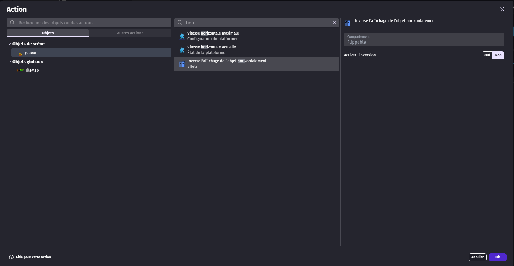
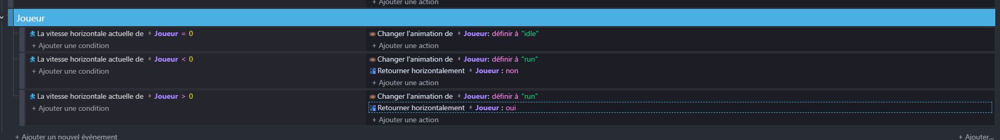

## Détection de la mort

Quand le joueur n'a plus de vie, on vas devoir lui faire recommencé le jeux.
pour cela on vas créée un nouveau évènement dans le groupe joueur

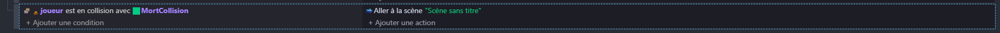

Nous allons retourner dans l'onglet de scène et créer un nouveau sprite que nous appellerons "MortCollision".

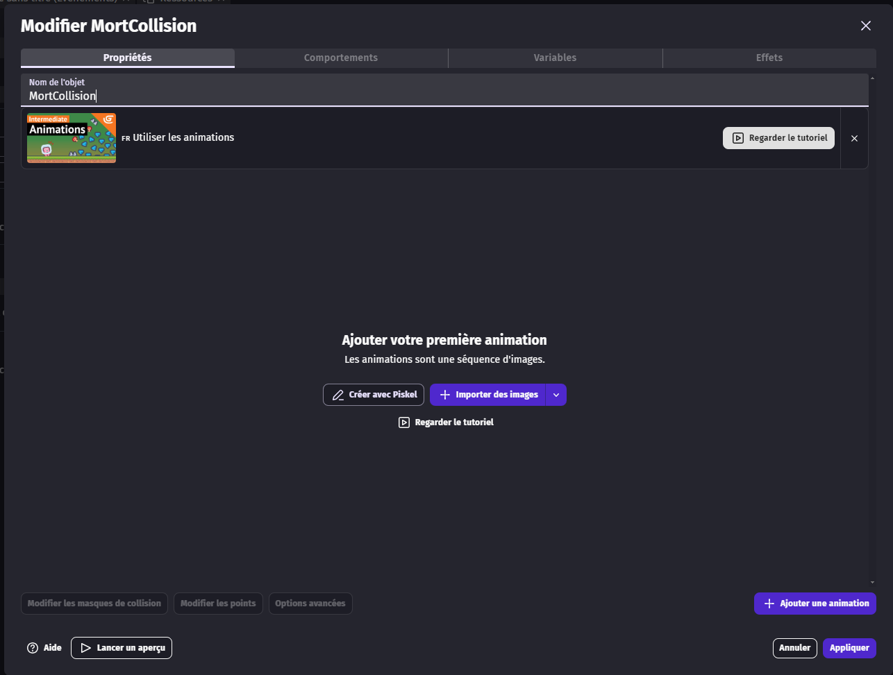

Cette fois-ci, cliquez sur "créer avec Piskel".

Premièrement, cliquez sur le pot de peinture.
Puis choisissez la couleur que vous voulez.
Enfin, cliquez une fois sur la zone centrale.

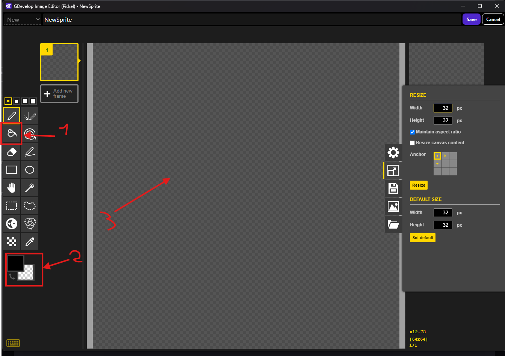

Enfin, sauvegardez.

Nous allons ajouter un nouveau calque que nous appellerons "collision".

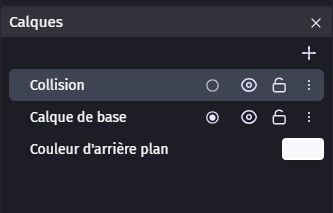

Sélectionnez le calque "Collision" en appuyant sur le petit bouton à côté du nom.
Il faudra faire attention à le retirer une fois que nous aurons fini les collisions.

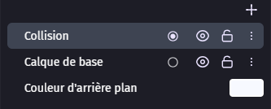

Ensuite, glissez-déposez l'objet "MortCollision" dans la scène et agrandissez-le pour qu'il fasse la bonne taille.
Pour dupliquer l'élément, vous pouvez appuyer sur les touches "Ctrl + D".

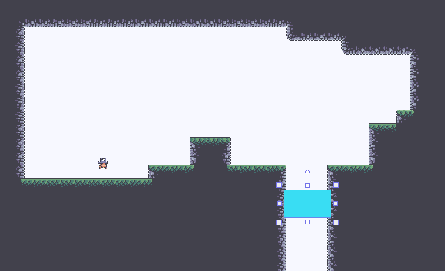

Enfin, nous allons cacher le calque de collision et sélectionner de nouveau le "calque de base".

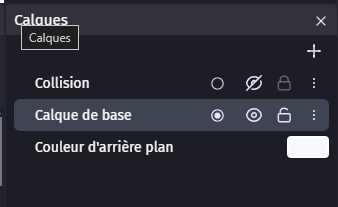

Maintenant, nous allons retourner dans l'onglet des évènements et ajouter un nouvel évènement dans le groupe "Joueur".

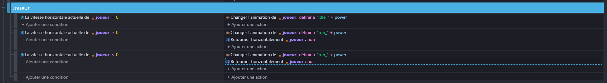

Choisissez comme condition "collision" et sélectionnez notre objet "MortCollision".

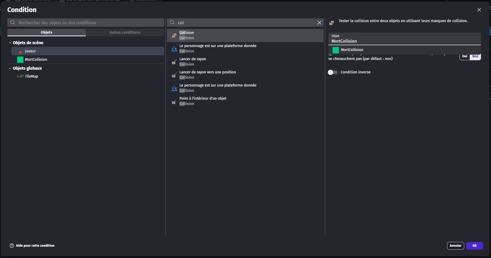

En action, nous allons pour l'instant recharger la scène. Plus tard, nous retirerons une vie au joueur.

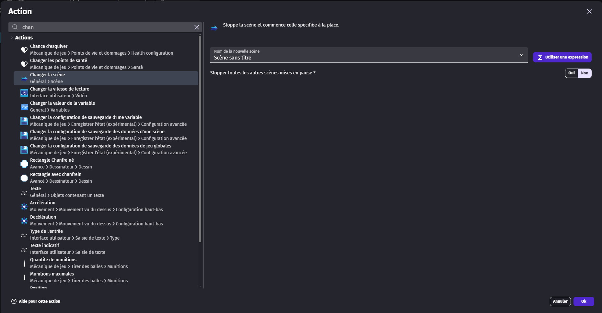

Maintenant, nous pouvons tester notre jeu afin de vérifier si tout fonctionne correctement.

