# Objets à collecter

## La pièce

Le premier objet à collecter que nous allons mettre en place est la pièce.

Nous allons donc ajouter un nouveau sprite que nous appellerons "Coin".
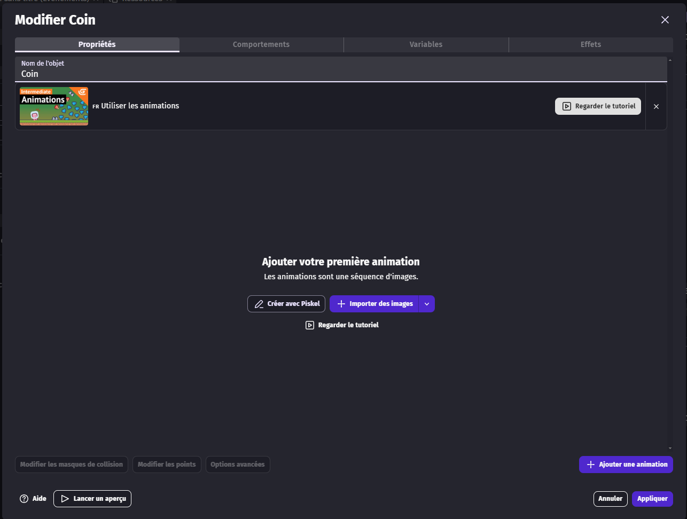

Nous allons lui ajouter les sprites d'animation qui se trouvent dans le dossier "props/Gold Coin" que nous avons téléchargé précédemment.

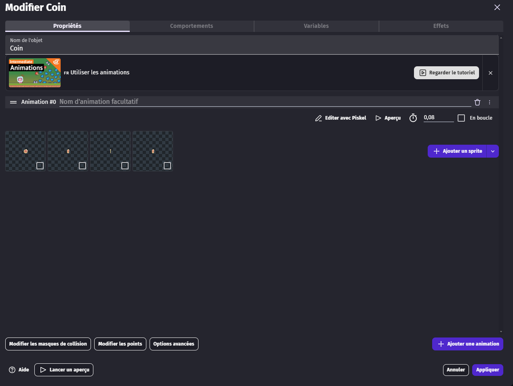

Mettez bien l'animation en boucle.

Puis cliquez sur "Appliquer".

Dans l'onglet "Évènement", nous allons ajouter un nouveau groupe d'évènements que nous appellerons "Collectible".

(Rappel : faites un clic droit sur "Ajouter un nouvel évènement", puis cliquez sur "Ajouter un groupe d'évènements".)

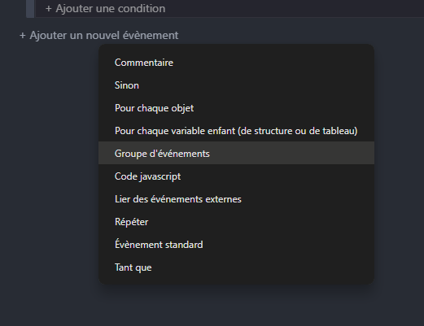

Puis nous allons ajouter un nouvel évènement dans ce groupe.

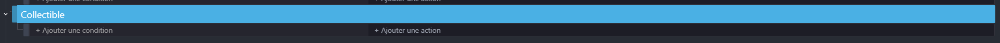

Nous allons mettre comme condition que si le joueur touche l'objet à collecter, alors nous allons ajouter trois actions : supprimer l'objet à collecter, ajouter 1 à la variable globale "coins" et ajouter 100 points à la variable globale "score".

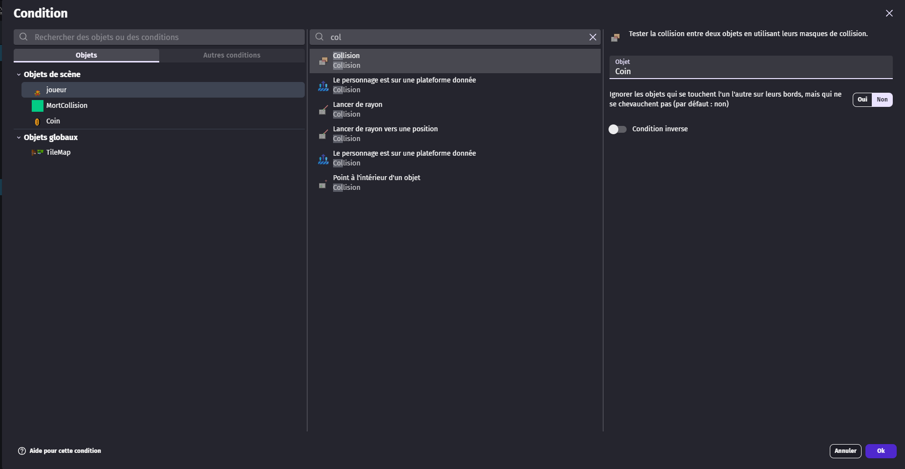
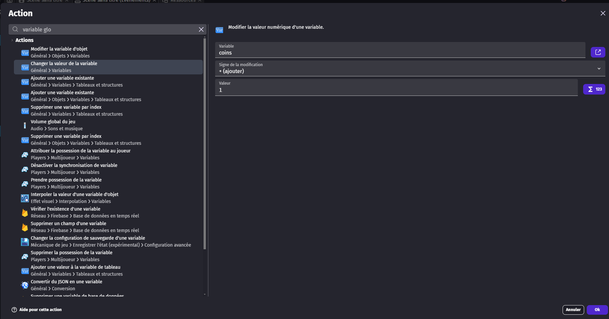
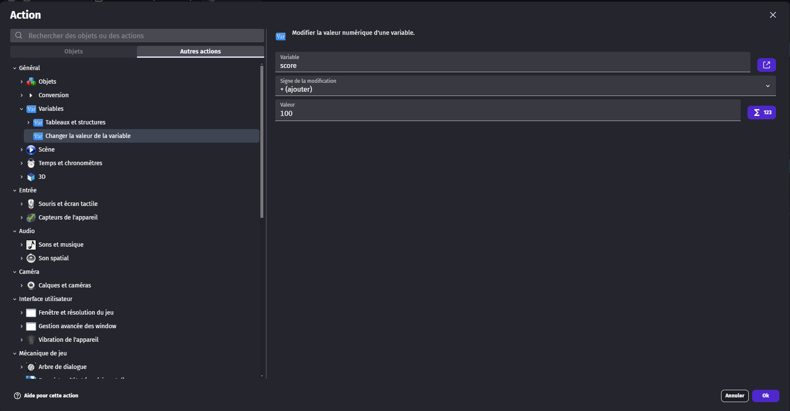
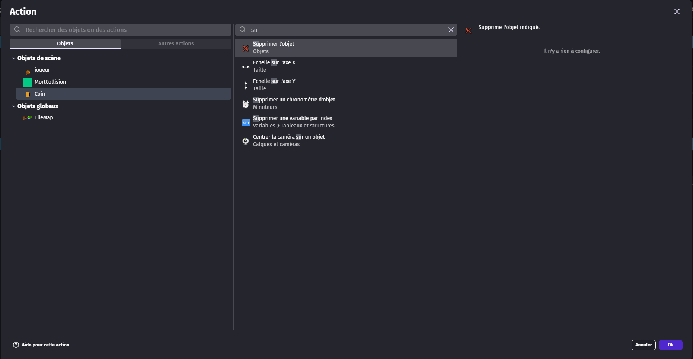
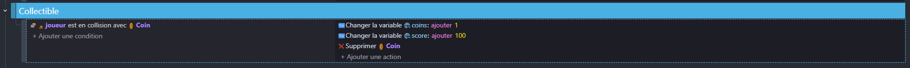

Maintenant, nous allons retourner dans l'onglet "Scène" et définir l'objet "Coin" comme objet global, afin qu'il puisse être utilisé dans toutes les scènes du jeu.

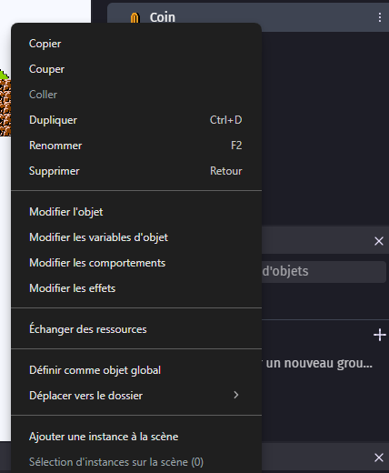

Une fois cela fait, vous pouvez placer des pièces un peu partout dans notre monde.

Nous pourrons voir le nombre de pièces collectées à l'étape suivante, lorsque nous créerons l'interface du jeu.

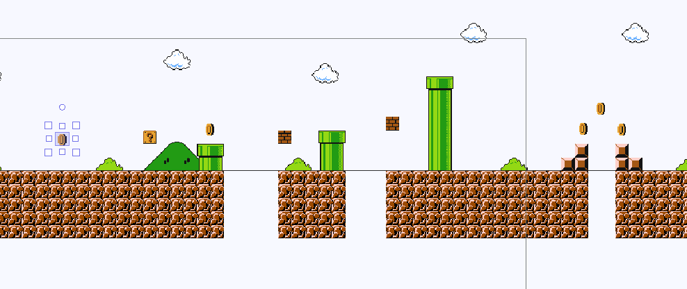

# Potion de soin

En suivant la même logique que pour la pièce, nous allons ajouter un nouveau sprite que nous appellerons "Potion".

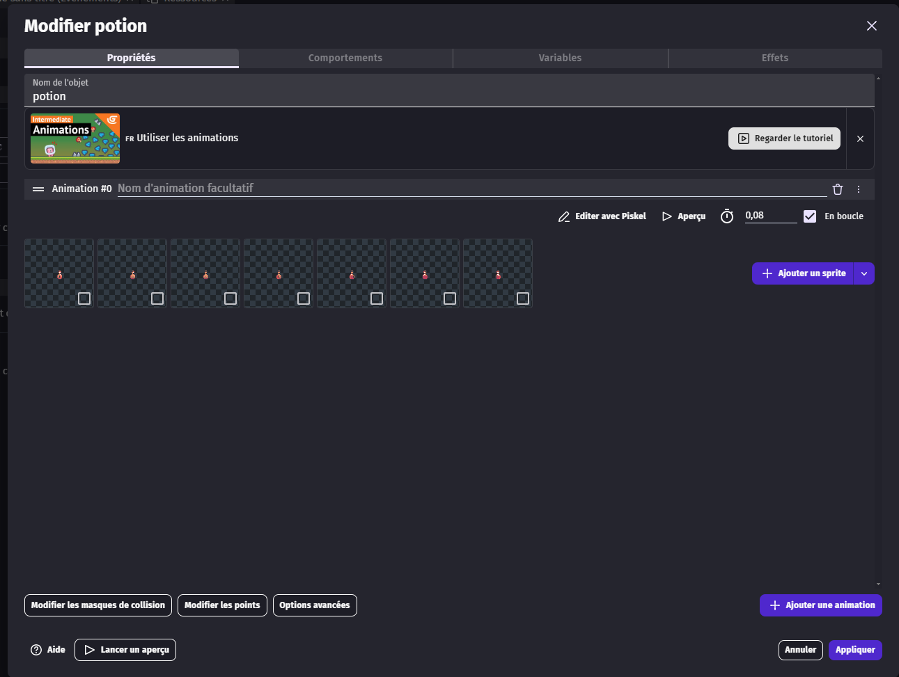
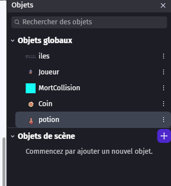
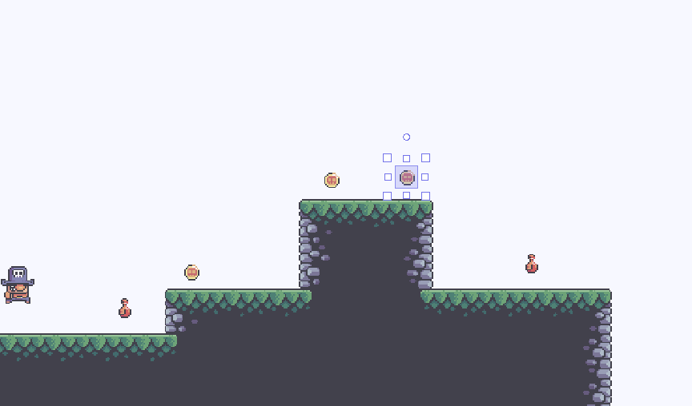

Maintenant, nous allons ajouter un nouvel évènement dans le groupe "Collectible" que nous avons créé précédemment.

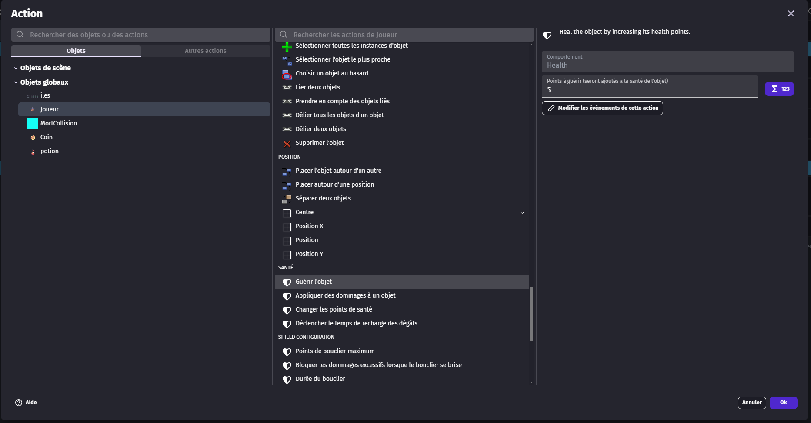
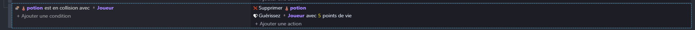

Cette potion permettra, si le joueur touche l'objet à collecter, de supprimer l'objet et de soigner le joueur.

## Diamant

Le diamant est un autre objet à collecter que nous allons ajouter dans le jeu. Il permettra d'ajouter 1 point de vie au joueur et servira de fin de niveau pour le niveau 1.

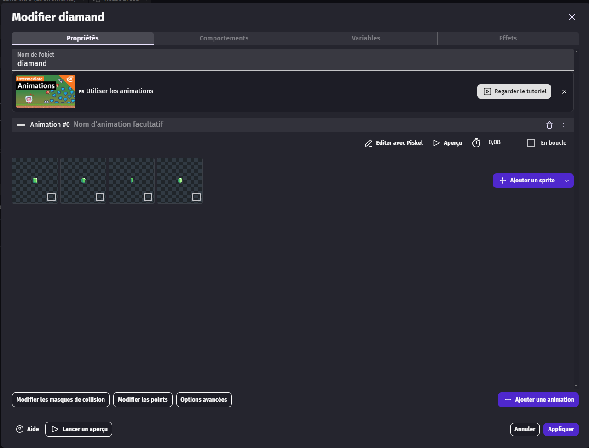

Pour l'évènement, nous allons ajouter "1" à la variable globale "life", supprimer le diamant, puis recharger la scène, comme lorsque le joueur tombe dans le vide.

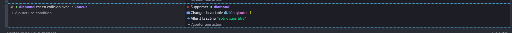

Il faudra bien sûr mettre également le diamant en tant qu'objet global afin de pouvoir l'utiliser dans toutes les scènes du jeu.

## Gestion de la vie

Pour finir, nous allons ajouter deux actions dans le même évènement que le zoom de caméra au démarrage du jeu : les points de vie maximum du joueur sont égaux à la variable globale "life", et les points de vie actuels du joueur sont égaux à la variable globale "life".

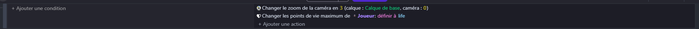
