# HUD

## Création du calque HUD

Afin de voir la vie et le nombre de pièces collectées, nous allons créer un calque HUD.

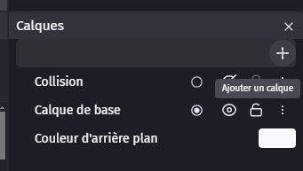
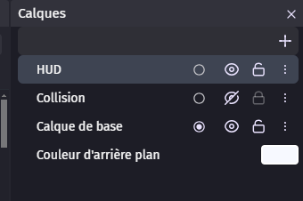
Sélectionnez ensuite le calque HUD.

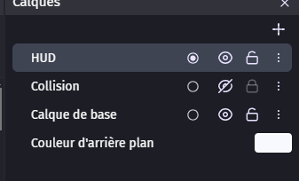

## Ajout de la barre de vie

Nous allons d'abord ajouter la barre de vie.

Pour cela, ajoutez un objet "Barre de ressource".

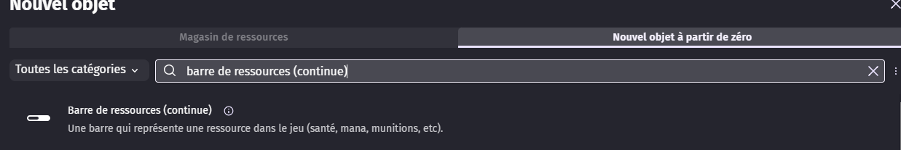

Sélectionnez l'une des barres que vous souhaitez utiliser. Je recommande une barre simple et rouge.

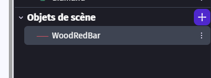

Puis glissez l'objet sur la scène, à l'endroit où vous souhaitez afficher la barre de vie.
Pour la placer correctement, vous pouvez dézoomer la scène et afficher le cadre de la scène.
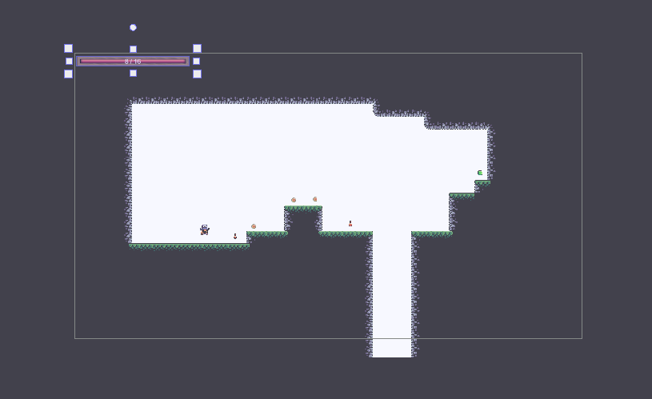

Une fois cela fait, allez dans l'onglet des évènements et ajoutez un nouvel évènement que nous allons glisser au même niveau que notre autre évènement vide.

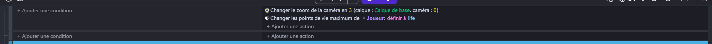

Nous ne mettons aucune condition. En action, nous allons modifier la valeur maximale de la barre de vie pour qu'elle soit égale à la variable globale "life".
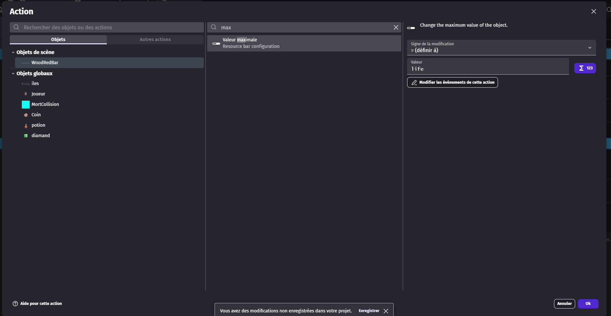

Nous allons ajouter une deuxième action : modifier la valeur de la barre de vie pour qu'elle soit égale à celle du joueur.
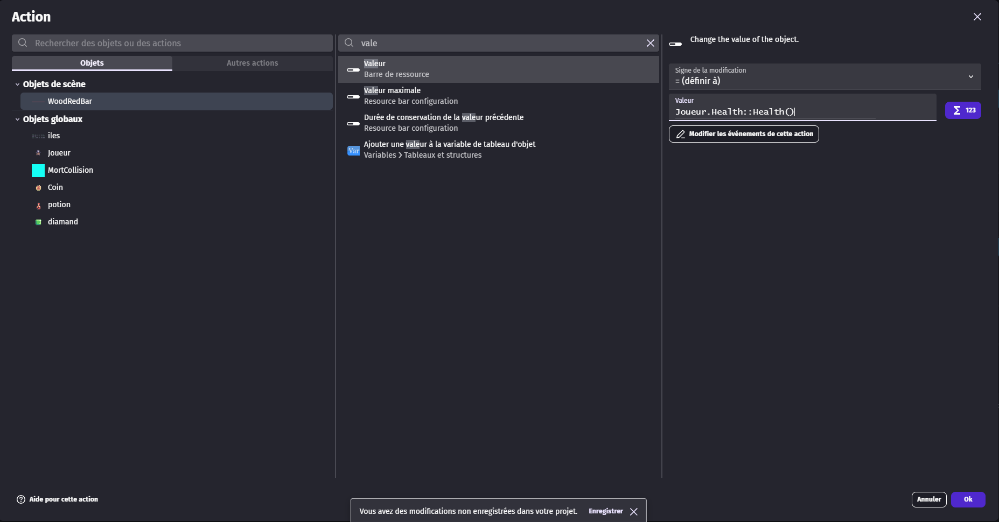

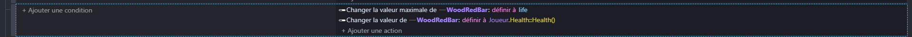

## Ajout du compteur de pièces

Nous allons ajouter un compteur de pièces. Pour cela, ajoutez un objet "Texte" dans lequel nous écrirons "pièces : 0", puis placez-le à côté de la barre de vie.

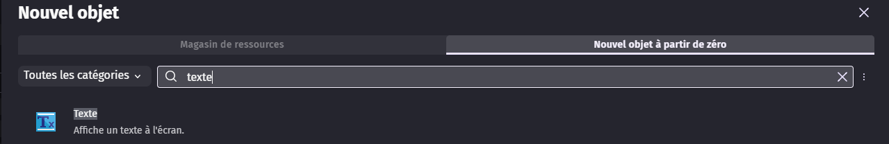
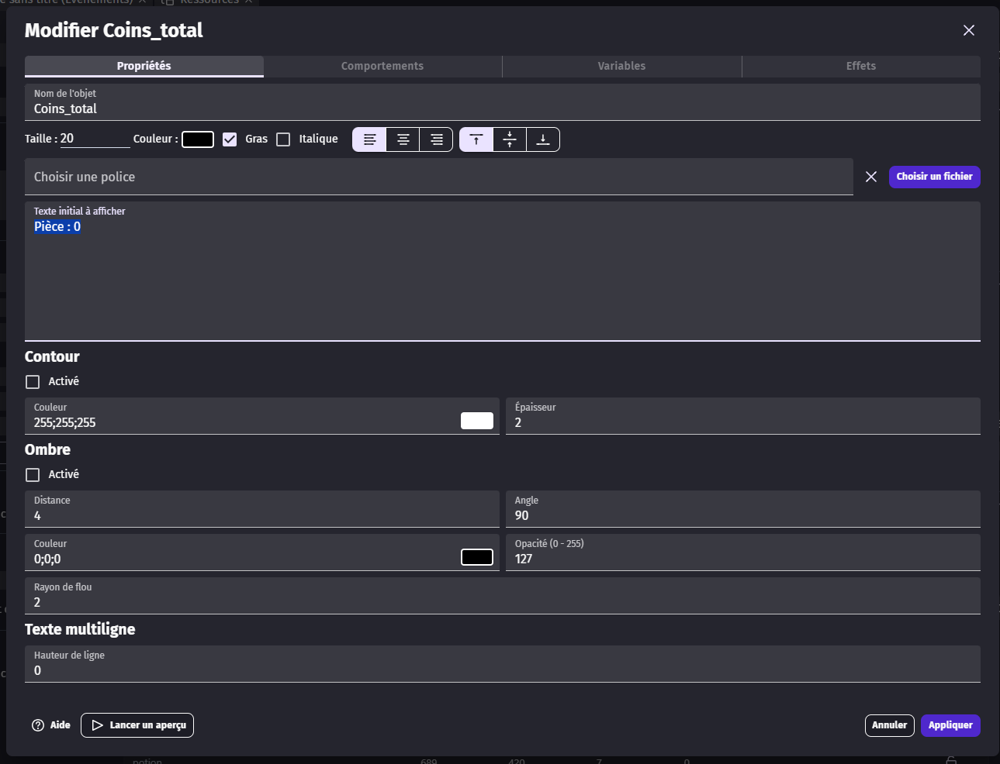

Dans les évènements, ajoutez un nouvel évènement que nous allons glisser au même niveau que notre autre évènement vide.

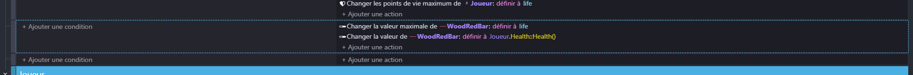

Nous ne mettons aucune condition. En action, nous allons modifier le texte pour qu'il soit égal à "pièces : " + la variable globale "coins".
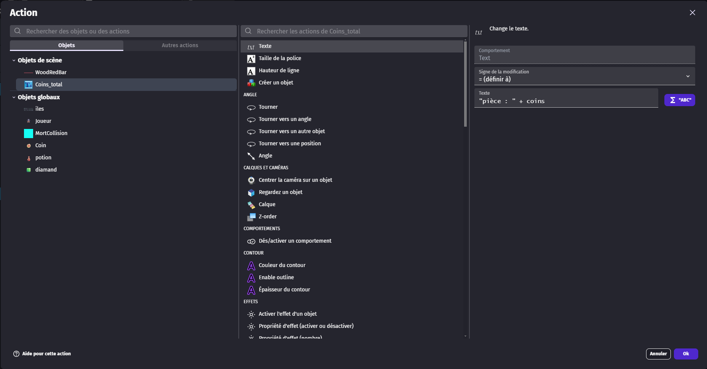

Nous allons aussi ajouter, quand le joueur tombe dans le vide et quand il récupère un diamant, que le compteur de coins et le score soient remis à 0.

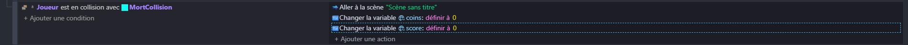
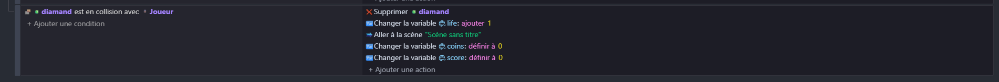

## Affichage du score

En faisant la même chose que pour le compteur de pièces, nous allons ajouter un compteur de score. Pour cela, ajoutez un objet "Texte" dans lequel nous écrirons "score : 0", puis placez-le à côté du compteur de pièces.

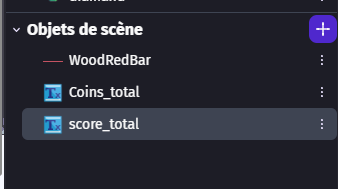
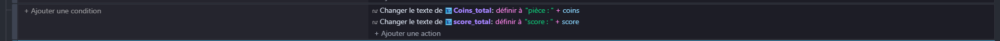

## Finalité

Pour finir cette partie, nous allons mettre les objets que nous avons créés en tant qu'objets globaux, afin de pouvoir les utiliser dans toutes les scènes du jeu.

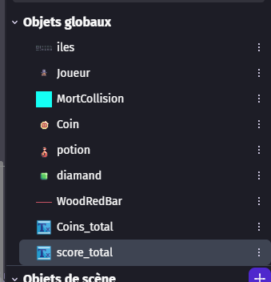
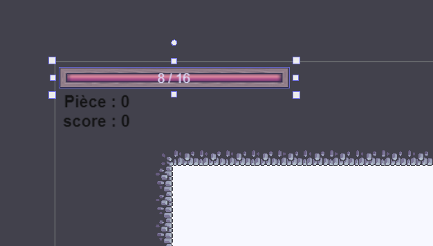

