# Épée

## Ajout de l'épée

Pour ajouter l'épée, nous allons créer un nouveau sprite que nous appellerons "épée".

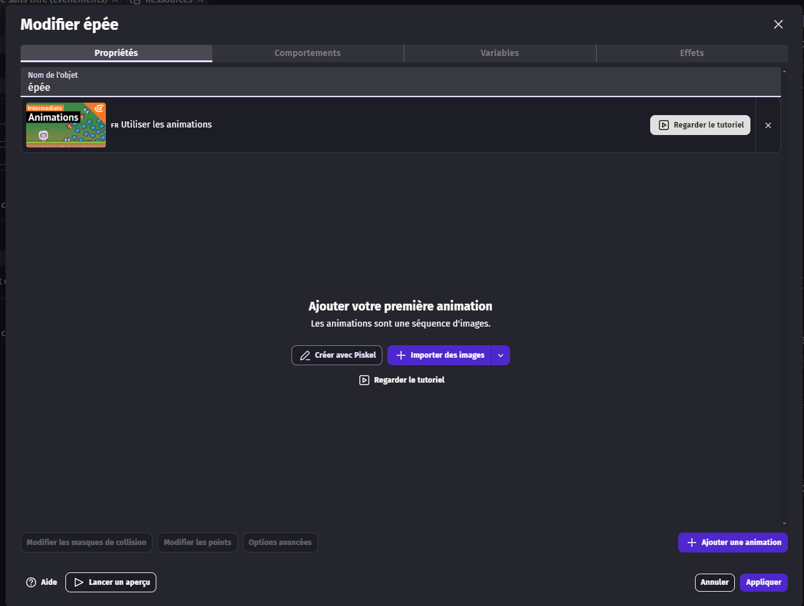
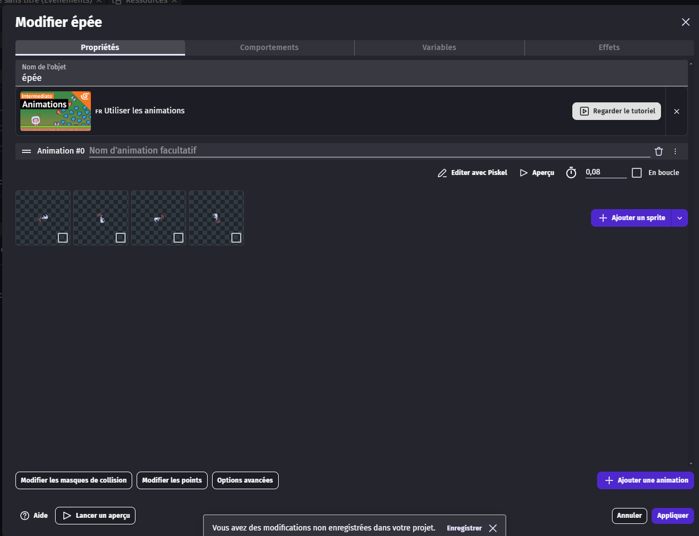

Nous allons modifier le point d'origine de l'épée pour qu'elle apparaisse au bon endroit.
Pour cela, retournez dans "Modifier les points", sélectionnez le point "origine" de l'épée, puis placez-le à l'endroit où nous voulons que l'épée soit.

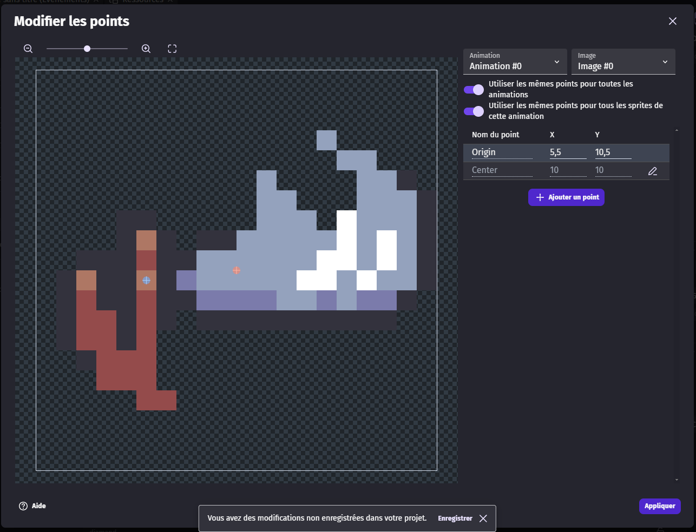

Pour éviter tout problème, nous allons directement placer l'objet épée dans les objets globaux.

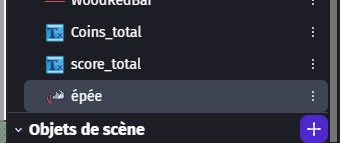

## Ajout d'un groupe ennemi

Pour la suite, nous allons ajouter tout de suite un groupe ennemi.
Pour cela, cliquez sur le bouton plus "Ajouter un groupe", puis appelez-le "ennemi".
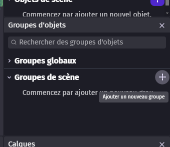

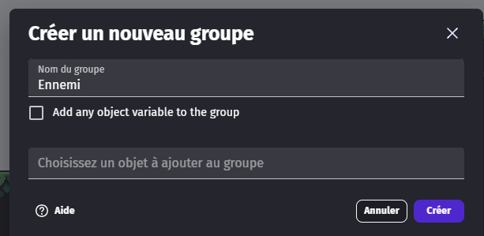

Puis mettez-le en tant que groupe global.

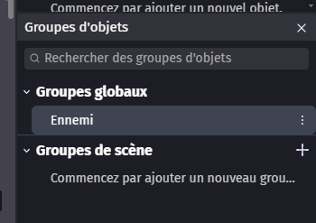

## Action de l'épée

Nous allons aller dans l'onglet des évènements de l'épée et ajouter un nouvel évènement que nous allons glisser dans le groupe "Joueur".

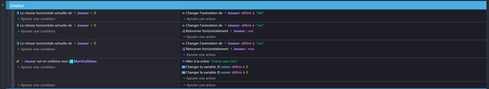

Nous allons mettre comme condition que si le joueur appuie sur une touche, dans mon cas la touche "F", cela déclenche l'attaque. Vous pouvez choisir la touche que vous voulez, mais je vous conseille de choisir une touche facile d'accès pour le joueur.

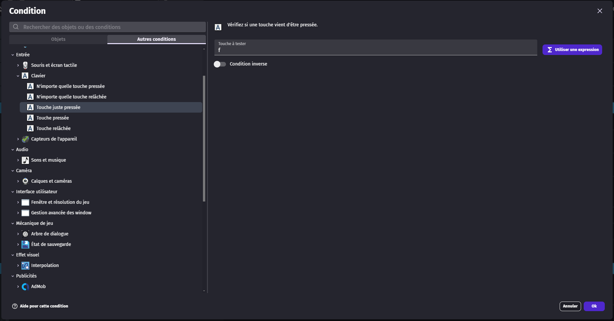

En action, nous allons créer un objet "épée" et le placer au point "sword" que nous avons créé auparavant.
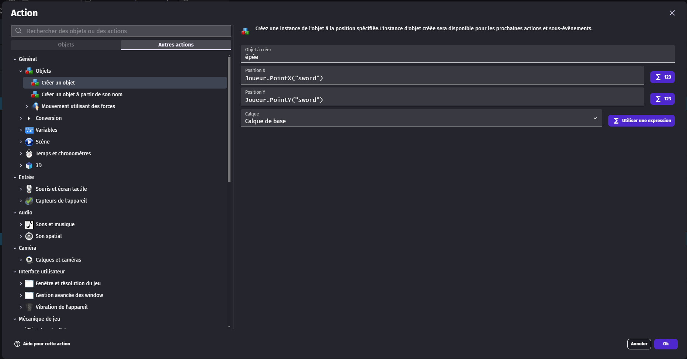

Nous allons maintenant ajouter un nouvel évènement dans le groupe "Joueur".
Cet évènement fera que, si l'objet "épée" a fini son animation, il sera supprimé.

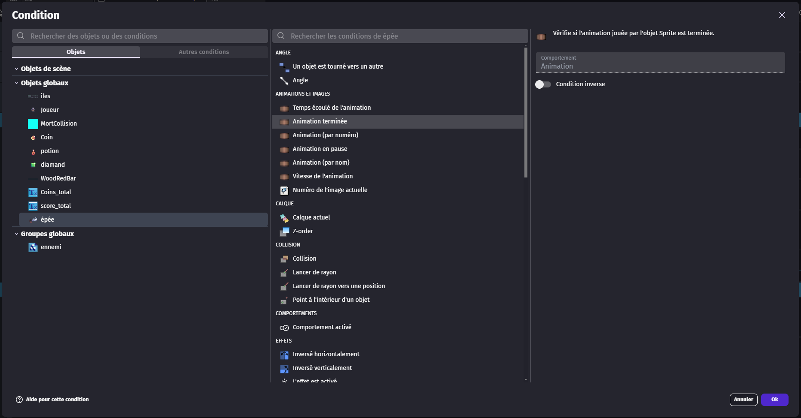
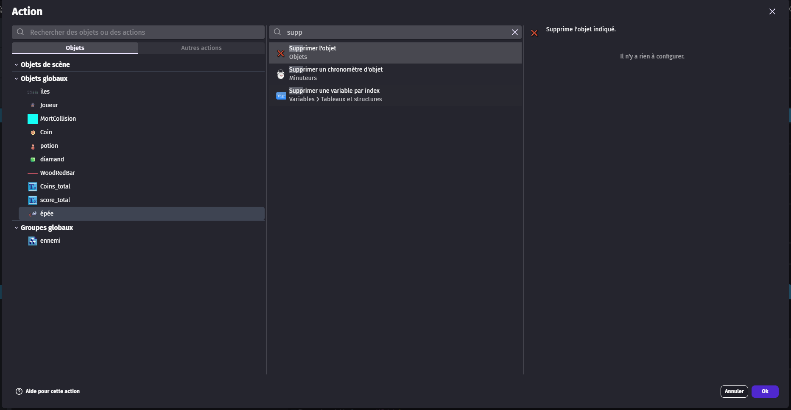

Enfin, nous allons ajouter un dernier évènement. Si l'objet "épée" touche un objet du groupe "ennemi", l'ennemi sera supprimé et nous ajouterons 150 à la variable globale "score".

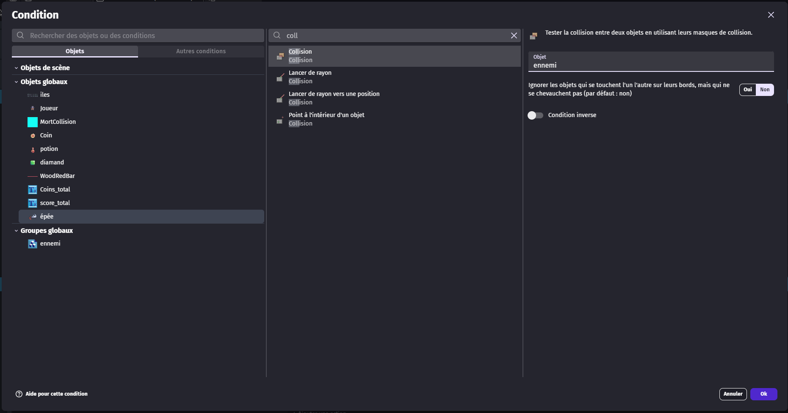
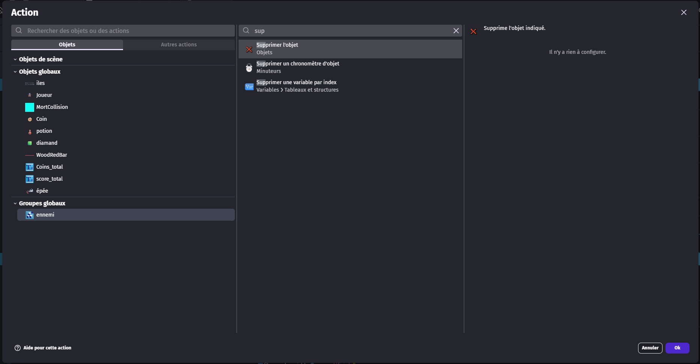
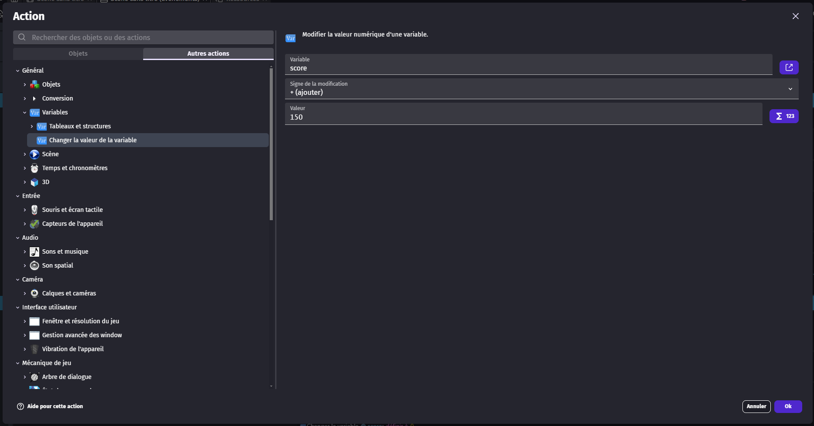

Voici à quoi cela ressemble.

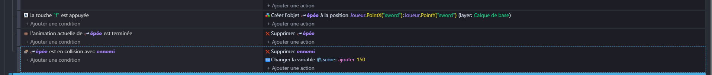

Afin que notre épée suive le joueur, nous allons ajouter un dernier évènement sans condition. Il fera que, si l'objet "épée" existe, il sera placé au point "sword" du joueur.
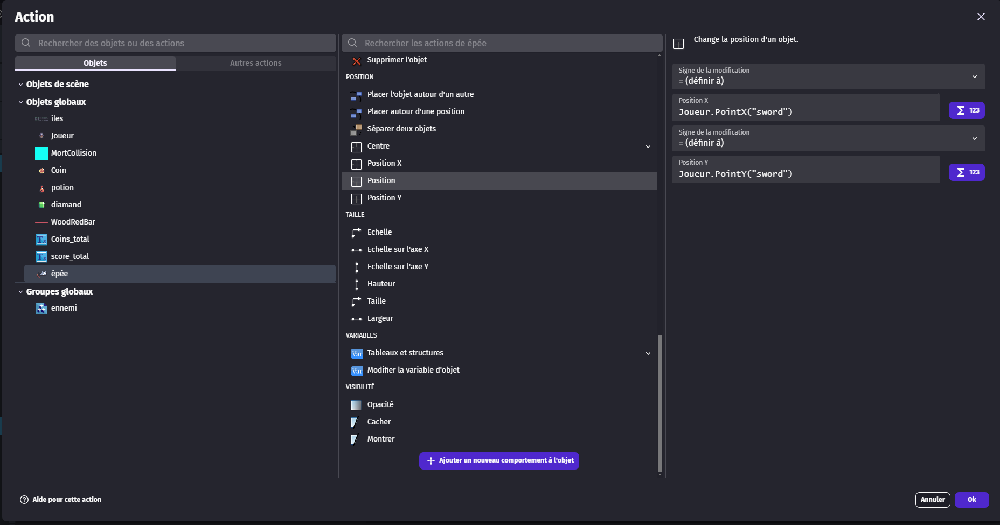

Dans les évènements de déplacement du joueur, nous allons ajouter une action qui fera que si le joueur se retourne, l'objet "épée" se retourne aussi.
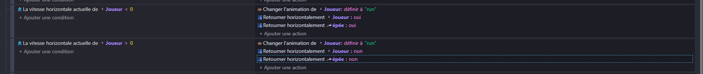
