# Ennemi

## L'étoile de mer

Nous allons ajouter un nouvel ennemi. Pour cela, nous allons créer un nouveau sprite que nous appellerons "etoile_de_mer".
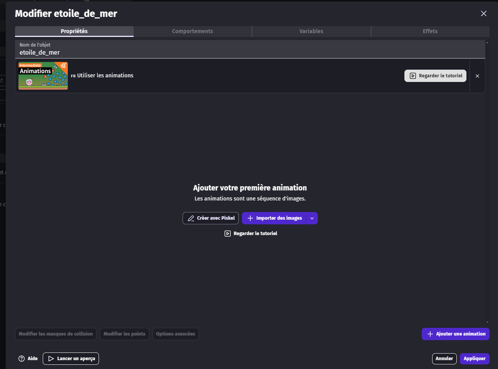

Nous allons ajouter les sprites d'animation qui se trouvent dans le dossier "star".

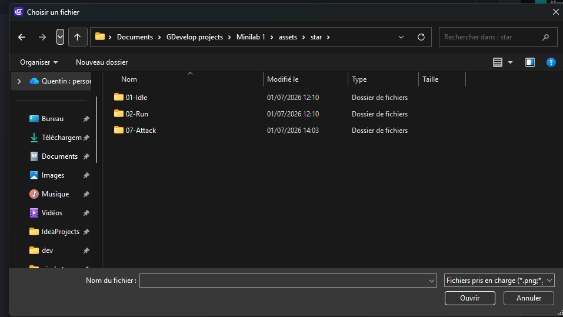
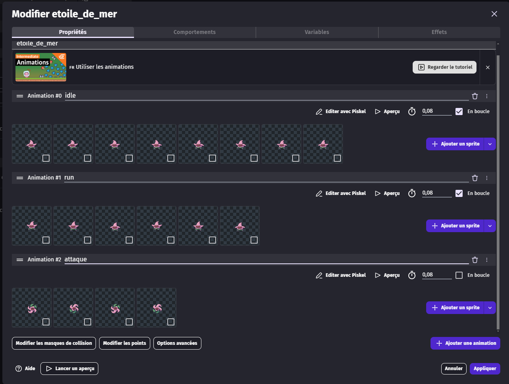

Nous allons aller dans les comportements pour ajouter le comportement "Personnage se déplaçant sur des plateformes".
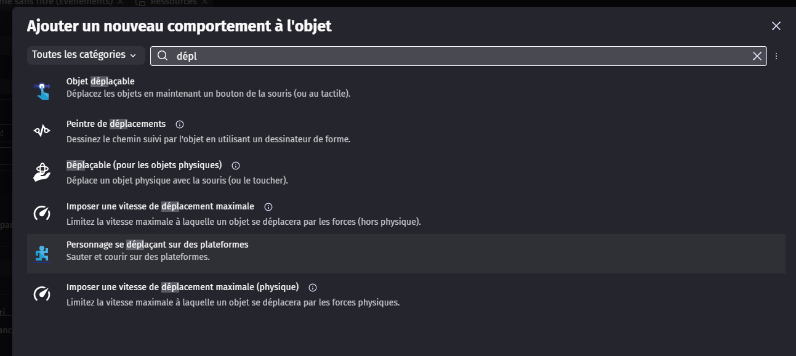
Puis nous allons désactiver "les contrôles du clavier".
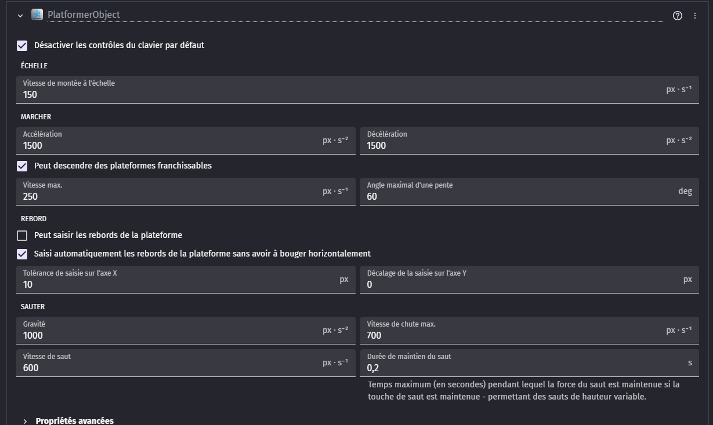

## Action de l'ennemi

Nous allons retourner dans l'onglet des évènements afin d'ajouter les actions de l'ennemi.

Nous allons ajouter un nouveau groupe d'évènements que nous appellerons "ennemi".

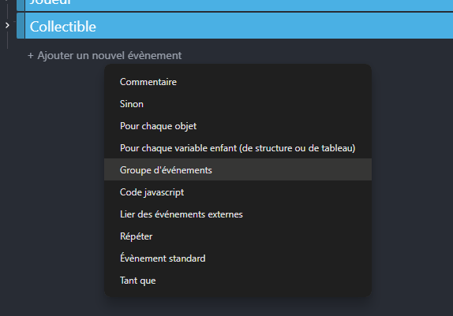
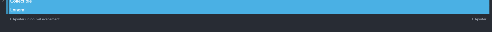

Nous allons ajouter un nouvel évènement dans ce groupe.

En condition, nous allons mettre que si l'ennemi entre en collision avec le joueur, alors nous allons ajouter deux actions : retirer 1 point de vie au joueur et appliquer l'animation "attaque" à l'ennemi.

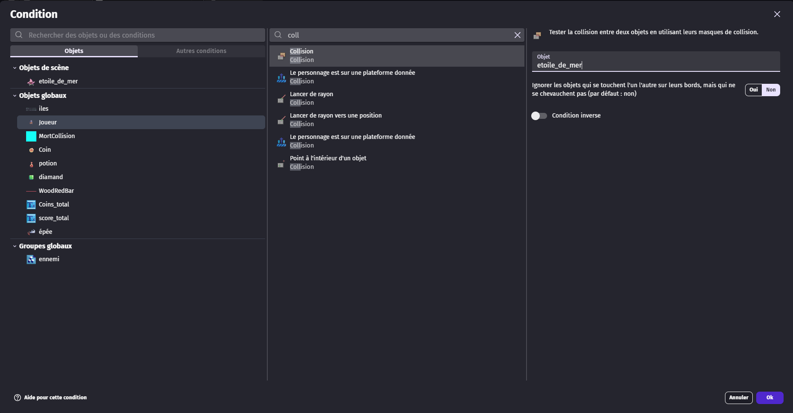
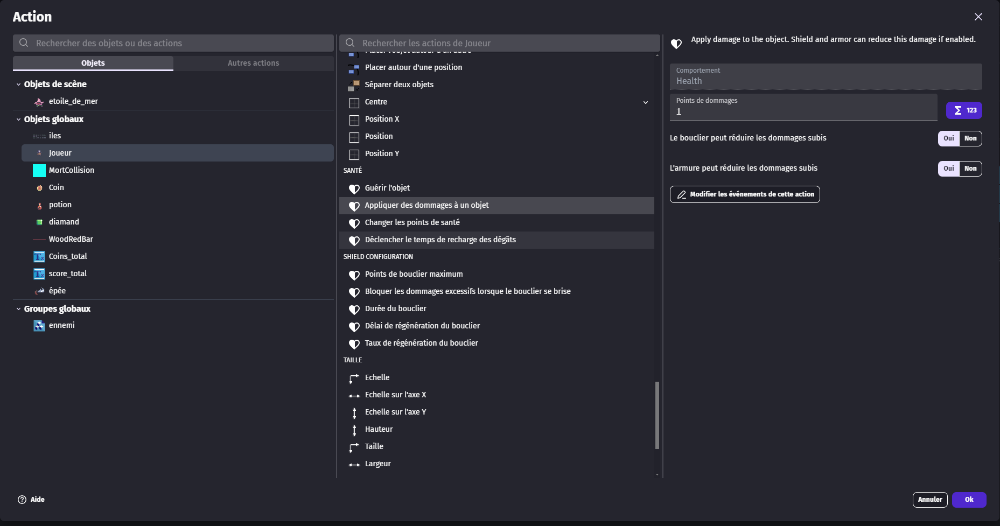

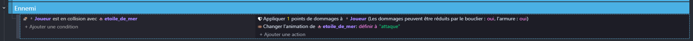

Actuellement, quand l'ennemi finit son animation, il reste sur l'animation "attaque". Nous allons donc ajouter un nouvel évènement qui fera que, si l'ennemi a fini son animation, il appliquera l'animation "idle".

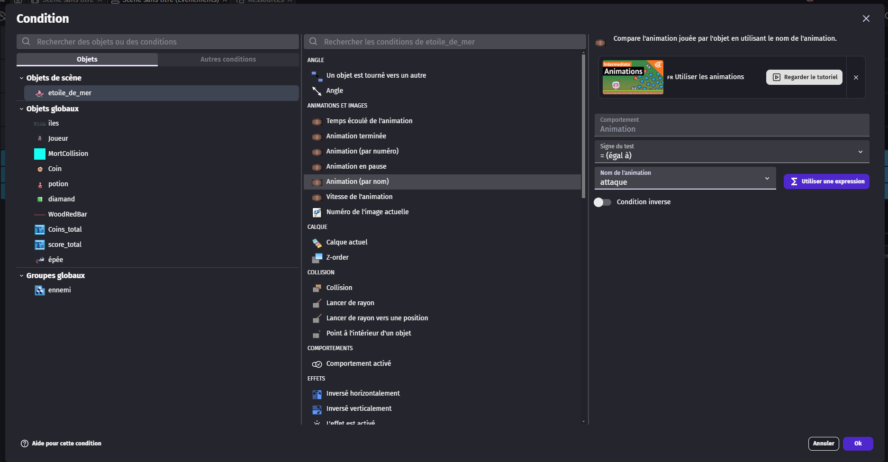
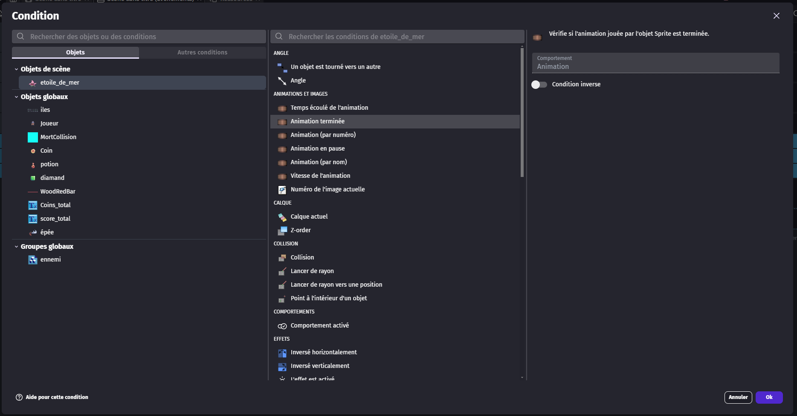
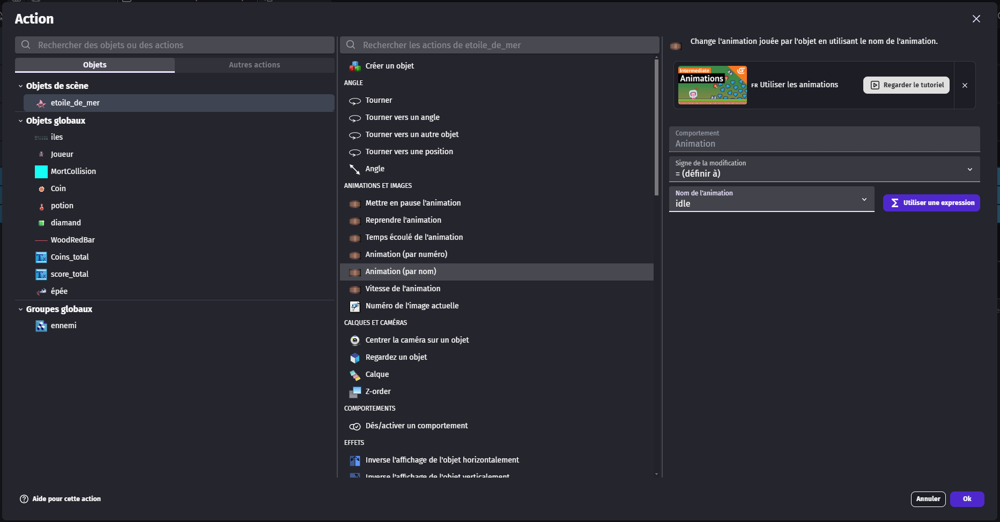

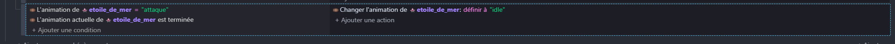

## Ajouter l'ennemi dans la scène et dans le groupe

Pour que le joueur puisse interagir avec l'ennemi, nous allons ajouter l'ennemi dans la scène et dans le groupe "ennemi" que nous avons créé précédemment.
Il suffit de double-cliquer sur le groupe "ennemi".
Puis ajoutez le sprite "etoile_de_mer" dans le groupe "ennemi".
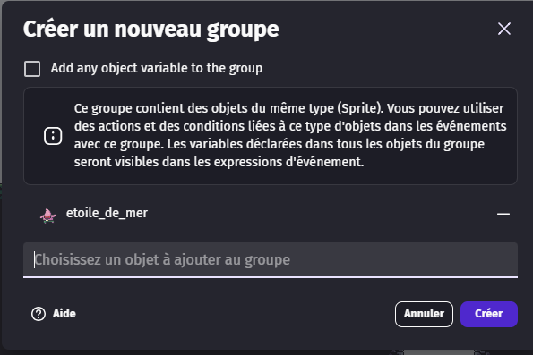

Maintenant, il suffit d'ajouter l'ennemi dans la scène.

## Amélioration du monde

À partir de tout ce qui a été fait précédemment, nous allons améliorer notre monde en l'agrandissant et en ajoutant les objets que nous avons créés précédemment.

