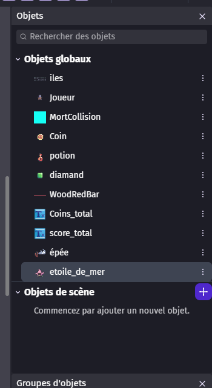
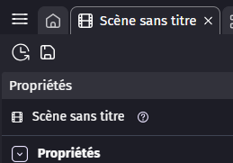
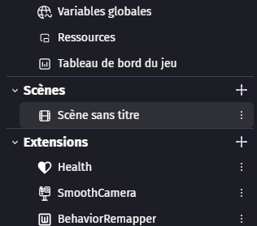
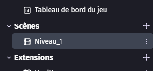
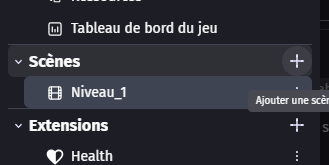
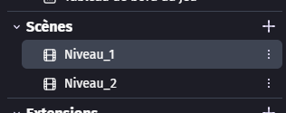

# Reprise du jour 2

## Vérifier le fonctionnement du jeu

La première étape de la journée est de vérifier que le jeu qu'on a créé hier fonctionne toujours correctement.

Pour cela, nous allons refaire une batterie de tests rapides afin de vérifier que tout fonctionne correctement.

## Vérifier que tous les objets soient bien des objets globaux

Nous allons vérifier que tous les objets que nous avons créés le premier jour soient bien des objets globaux.

Si ce n'est pas le cas, il faut faire un clic droit sur l'objet et cliquer sur "Définir comme objet global".

## Ajout des éléments du jour 2

Nous allons ensuite ajouter les éléments importants du deuxième jour.

En premier, nous allons renommer la scène actuelle en "Niveau_1" pour que ce soit plus clair.

Pour ce faire, nous allons cliquer sur les 3 barres en haut à gauche.

Puis nous allons double-cliquer sur le nom de la scène pour le modifier.

Puis nous allons appuyer sur le petit "plus" pour créer une nouvelle scène que nous allons nommer "Niveau_2".

Maintenant, nous allons double-cliquer sur la scène "Niveau_2" pour l'ouvrir et commencer à travailler dessus.
