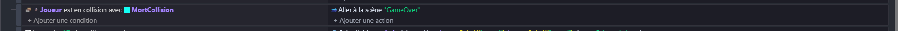
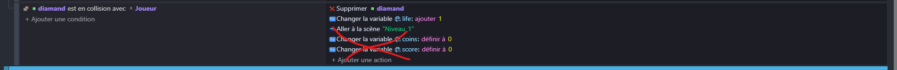
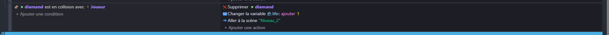
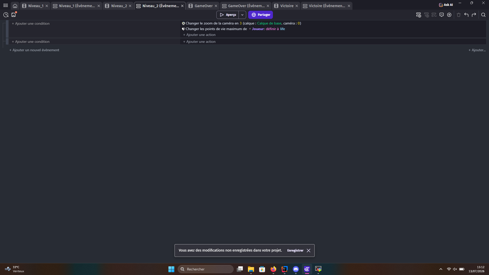
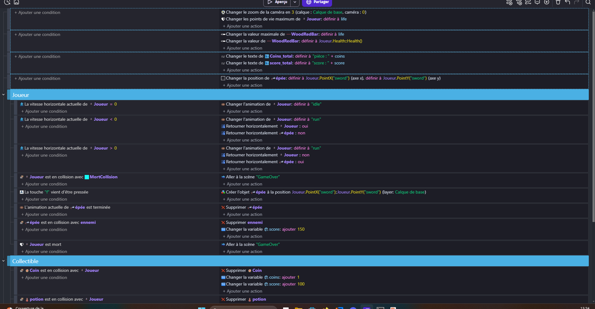
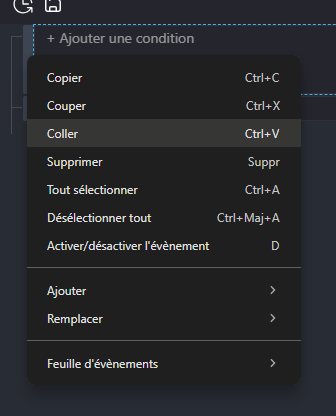
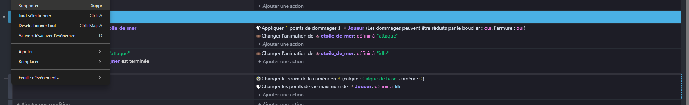

# Préparation

## Modification du cheminement

Étant donné que nous avons ajouté un nouveau niveau ainsi que des scènes de GameOver et de victoire, nous allons devoir modifier
les changements de scène du niveau 1.

Dans le niveau 1, nous allons changer le moment où nous touchons la zone de mort par cela :

Nous allons faire pareil quand le personnage meurt.

Et enfin, quand le joueur récupère le diamant, nous n'allons plus remettre à 0 le score et les pièces, mais nous allons aller
au niveau 2.

Avec ces changements, maintenant, quand nous obtenons le diamant, nous passons au niveau 2, et quand nous mourons, nous allons sur le
GameOver.

## Récupération des événements

Comme vous avez pu le remarquer, dans l'onglet des événements du niveau 2, nous n'avons aucun événement, à part celui que nous
avons ajouté à l'étape 2.

Pour régler ce problème, nous allons retourner dans les événements du niveau 1.

Puis nous allons faire le combo de touches "CTRL + A" (ou Cmd + A sur Mac) pour sélectionner tous les événements, puis le
combo de touches "CTRL + C" (ou Cmd + C sur Mac) afin de tout copier.
Nous pouvons nous assurer que les événements sont bien sélectionnés grâce à l'encadré bleu qui se trouve autour des événements.

Une fois cela fait, nous allons dans les événements du niveau 2, puis nous allons faire un clic droit sur la partie gauche de l'événement déjà existant, puis cliquer sur "Coller".

Nous pouvons voir que tous nos événements ont été ajoutés, et que l'événement que nous avions mis de base a été placé tout en bas.
Maintenant que nous avons tout le code, nous pouvons supprimer cet événement en faisant un clic droit dessus, puis en cliquant sur "Supprimer".

Maintenant, nous avons tous nos événements prêts dans notre niveau 2.
