# Ennemi

## Un nouvel ennemi

Nous allons ajouter un nouvel ennemi pour le niveau 2.

Ce dernier sera un crabe. Il se déplacera de droite à gauche en boucle et nous fera des dégâts si nous le touchons.

La première étape est de créer le crabe. Pour cela, nous allons créer un nouveau sprite.

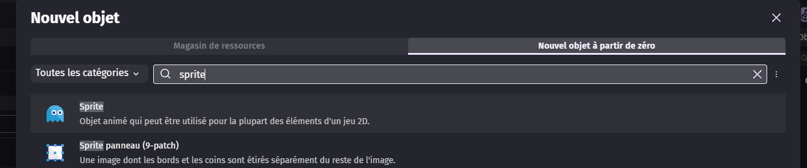

Puis nous allons lui mettre les animations "idle" et "run" qui se trouvent dans le dossier "crabe".
Nous n'oublions pas de mettre le nom des animations et de les mettre en boucle.

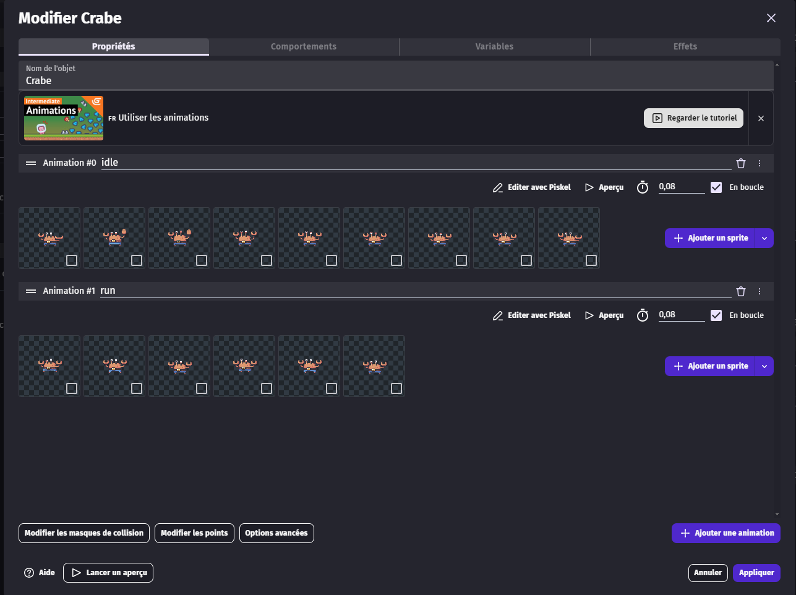

Dans les comportements, nous allons ajouter le comportement de "personnage se déplaçant sur des plateformes".

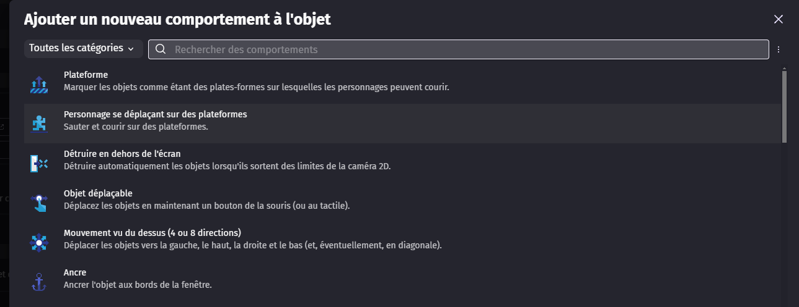

Et nous allons bien cocher "désactiver les contrôles par défaut du clavier" afin que le joueur ne puisse pas déplacer
l'ennemi.

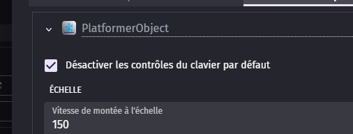

## Bord de collision

Afin que notre crabe n'avance pas à l'infini et qu'il puisse se retourner, nous allons ajouter des boîtes de collision,
comme ce que nous avons fait pour la zone de mort, mais nous n'allons pas tuer le crabe.

Pour ce faire, nous allons créer un nouveau sprite que nous allons appeler "gauche".

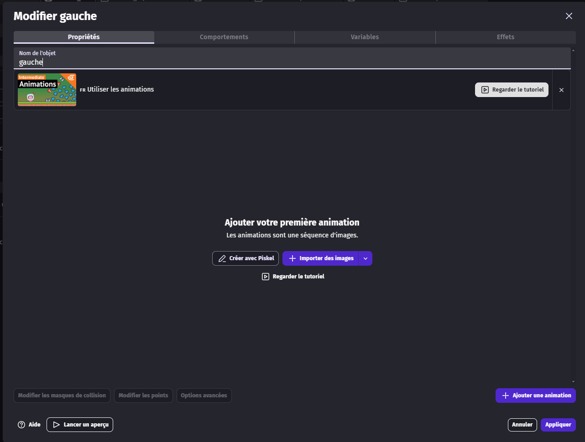

Et nous allons appuyer sur le bouton "Créer avec Piskel".

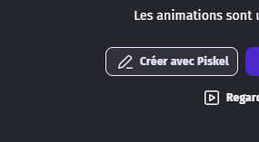

Dedans, nous allons sélectionner le pot de peinture, puis choisir la couleur que nous souhaitons utiliser et enfin cliquer au
centre de l'image.

Puis nous enregistrons.

Il est important de choisir une couleur différente de la zone de mort et plutôt visible, afin de faciliter
l'implémentation dans le jeu.

Nous allons créer un second sprite qui s'appellera "droite" et qui aura une couleur différente. Nous allons faire la même
manipulation que pour l'objet "gauche".

À la fin, nous devons nous retrouver avec ceci dans nos objets de scène :

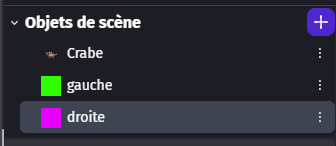

Nous les passerons à la fin en objets globaux.

Pour pouvoir mettre les collisions, nous allons créer un calque "collision", comme ce que nous avons fait dans le niveau 1.

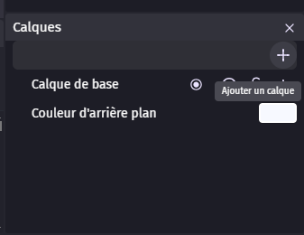

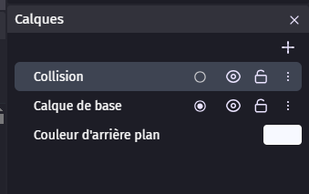

Puis nous allons le sélectionner.

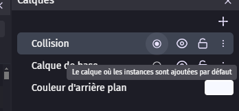

Nous allons mettre les collisions comme si nous voulions enfermer notre futur ennemi.

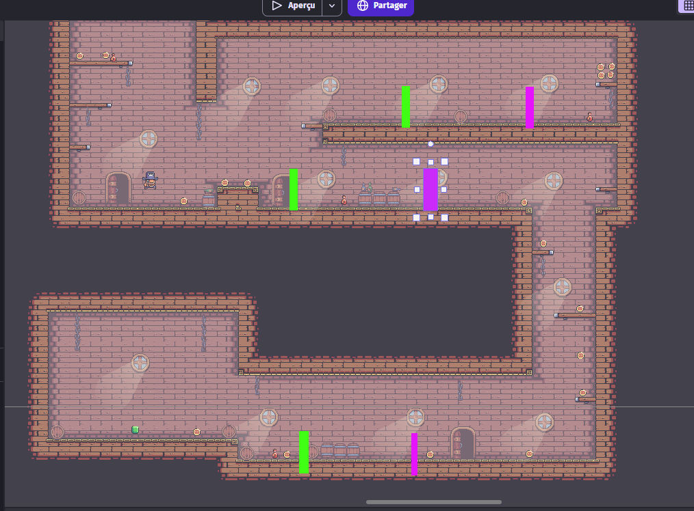

Il est important de laisser de la place entre les deux et de bien mettre la collision de gauche à gauche et celle de droite à droite.

Une fois cela fait, nous pouvons retourner sur le calque de base.

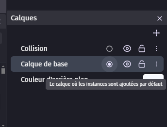

Puis nous allons placer nos crabes à l'intérieur des zones que nous avons créées.

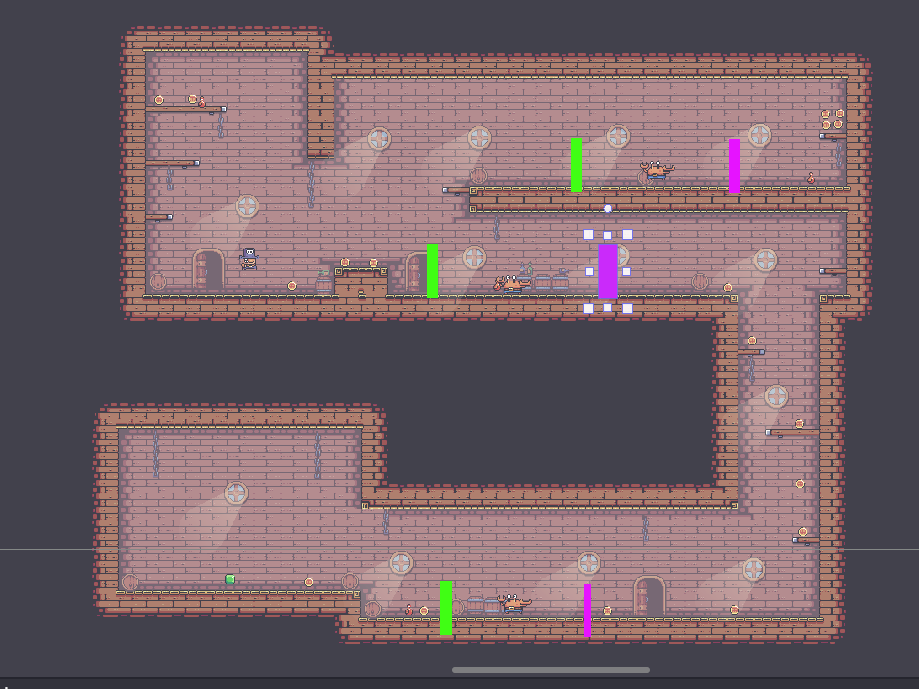

Une fois cela fait, nous allons ajouter le crabe dans le groupe des ennemis.

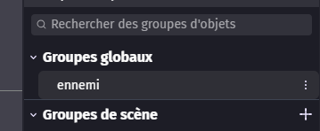
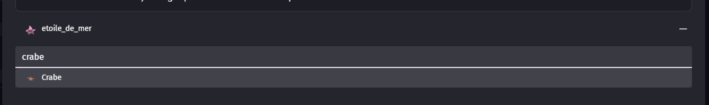

Maintenant, nous allons aller dans les événements.

Nous allons ajouter dans le groupe ennemi trois nouveaux événements vides.

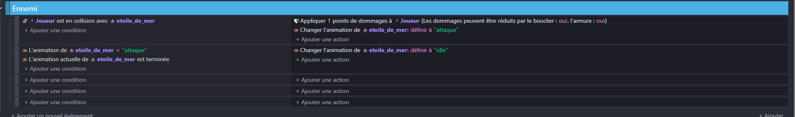

Dans le premier, nous allons vérifier si le crabe entre en collision avec le joueur, et si c'est le cas, nous allons retirer
2 points de vie au joueur.

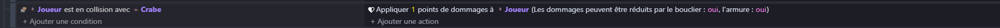

Dans un second événement, nous allons vérifier si le crabe entre en collision avec le bord droit. Si c'est le cas, nous
l'inverserons sur l'horizontale et nous lui appliquerons une force afin qu'il avance.
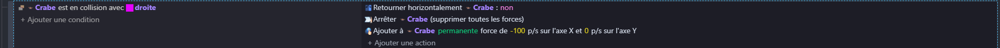

Puis, dans le dernier événement, nous allons faire pareil, mais avec le côté gauche.

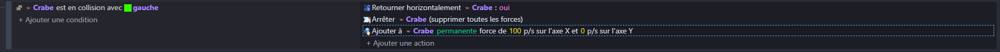

Nous allons ajouter un 4e événement qui servira à initialiser les crabes au lancement de la scène, en leur appliquant une
force de base et l'animation de marche.

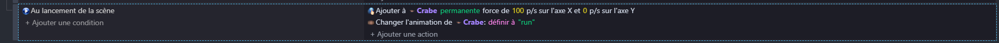

Nous pouvons maintenant nous remettre sur la scène et cacher le calque des collisions afin de pouvoir tester la scène et
les ennemis.

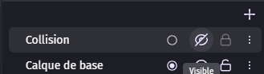

Nous avons maintenant un crabe fonctionnel qui va de gauche à droite et qui nous met des dégâts quand il nous touche.

Maintenant, nous allons mettre nos 3 objets de scène en tant qu'objets globaux, afin de pouvoir les utiliser dans d'autres
scènes.
