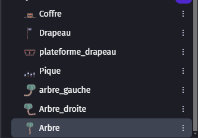
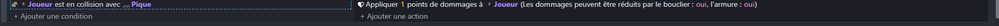

# Amélioration

## Ajout des décors

Maintenant que nous avons créé notre niveau 2 et ajouté un nouvel ennemi, nous allons améliorer le niveau 1.

Pour cela, comme pour les décorations du niveau 2, nous allons ajouter les décorations des îles.
Ces dernières se trouvent dans le dossier "iles/".

Il y a dedans un coffre, un drapeau, des piques ainsi que des arbres d'arrière-plan.

Chaque objet est un sprite.

Avec ces objets, nous pouvons améliorer le rendu graphique de notre niveau 1.

Pour les piques, voici le code à ajouter.

N'oubliez pas qu'il faut que les arbres aient un Z index négatif, afin qu'ils soient en arrière-plan et que le joueur soit toujours avec le Z index le plus élevé.
