# Reprise

## Vérification du jeu

La première étape de la journée consiste à vérifier que tout fonctionne correctement.

Cette étape est importante : après deux jours de développement, on peut se rendre compte que certaines fonctionnalités ne fonctionnent plus, ou que quelques éléments doivent être modifiés.

## Chronomètre

Nous allons créer un chronomètre afin de pouvoir faire du "speedrun" dans le jeu.

Pour cela, nous allons créer une nouvelle variable globale.

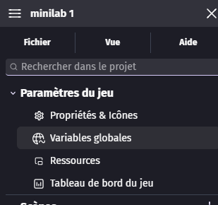

| Nom        |  Type  | Valeur de départ |
|:-----------|:------:|:----------------:|
| globalTime | nombre |        0         |

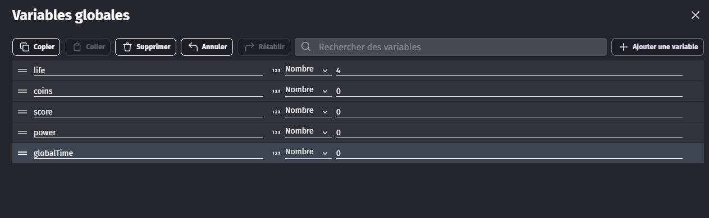

Puis on applique.

Nous allons ajouter un nouvel événement avec une condition vide. En action, nous ajoutons à la variable globale `globalTime` le temps écoulé depuis la dernière mise à jour du jeu.

Nous allons aussi ajouter, juste avant cette action, une remise à 0 de la variable `globalTime`, mais uniquement dans le niveau 1, afin de redémarrer correctement le chronomètre au début de la partie.

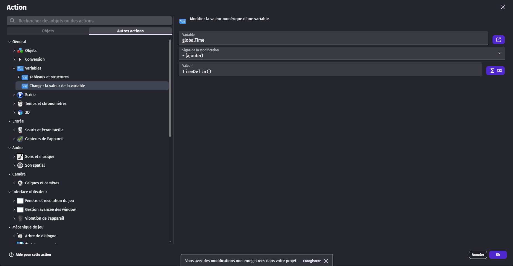

On met également cet événement dans le niveau 2, mais sans la partie qui remet le chronomètre à 0.

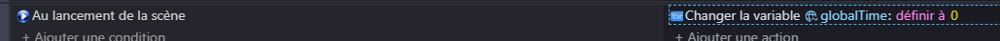

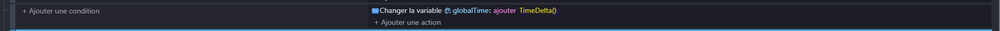

Nous allons créer un nouvel objet `Texte` afin d'afficher le chronomètre. Cet objet peut être créé dans n'importe quelle scène, car il sera ensuite transformé en objet global.

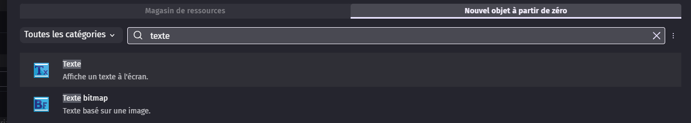

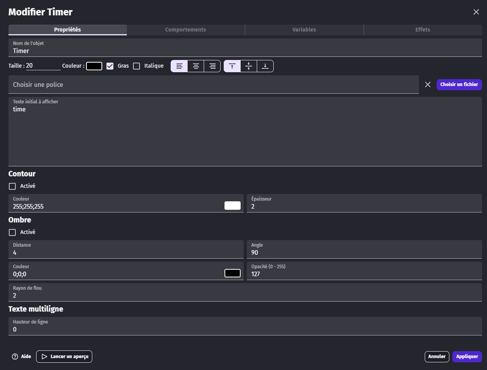

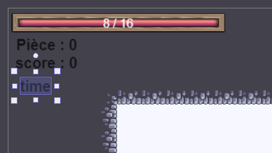

Pour l'instant, nous sommes dans le niveau 1, mais ces étapes devront être répétées dans tous les niveaux. Les événements pourront être copiés-collés pour gagner du temps.

Dans l'événement créé pour le chronomètre, nous allons ajouter une action qui modifie le texte pour afficher la valeur de `globalTime`.

Pour cela, nous allons arrondir la valeur à 3 chiffres après la virgule, afin de ne pas afficher un nombre avec trop de décimales.

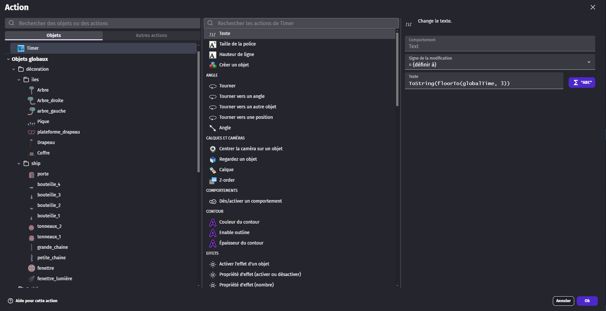

Une fois cela fait, nous allons transformer notre objet `Timer` en objet global afin de pouvoir utiliser les mêmes actions dans le niveau 2.

Nous pouvons maintenant vérifier que tout fonctionne correctement en passant d'un niveau à l'autre.

Nous allons ensuite ajouter un affichage propre du chronomètre dans la scène de victoire.

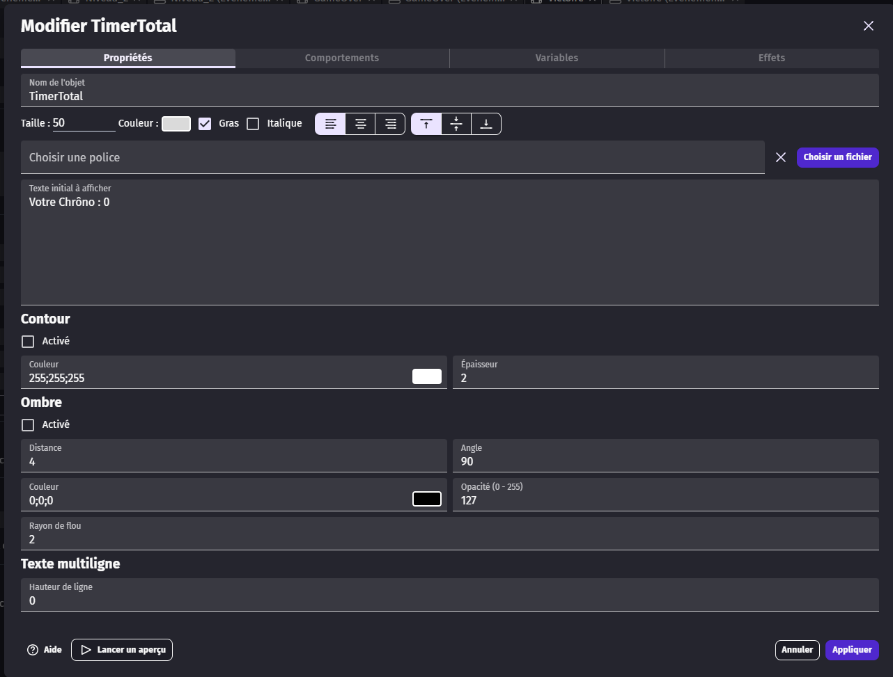

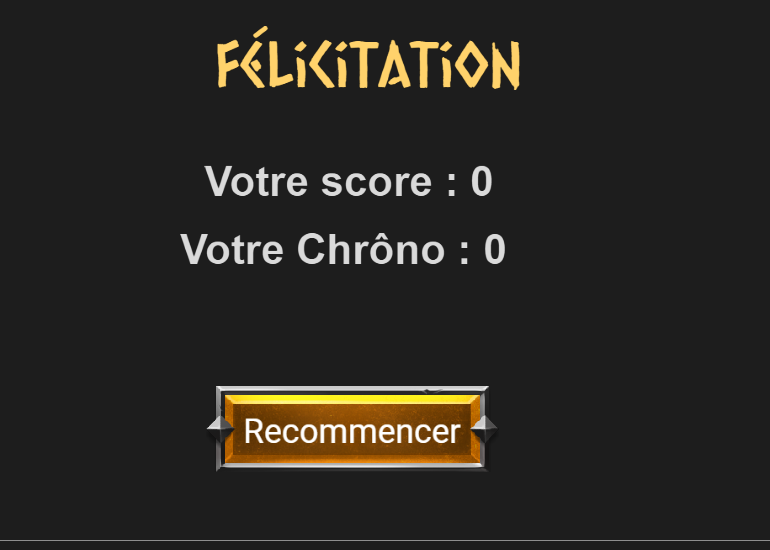

Dans les événements, nous ajoutons une action qui met le texte à `"Votre chrono : " + globalTime`.

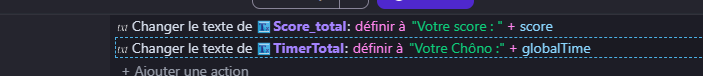
