# Capacité spéciale

## Un nouveau collectible

Nous allons ajouter un nouvel objet `Sprite` qui utilisera la potion bleue. Il peut être créé dans la scène de votre choix, car il sera ensuite transformé en objet global.

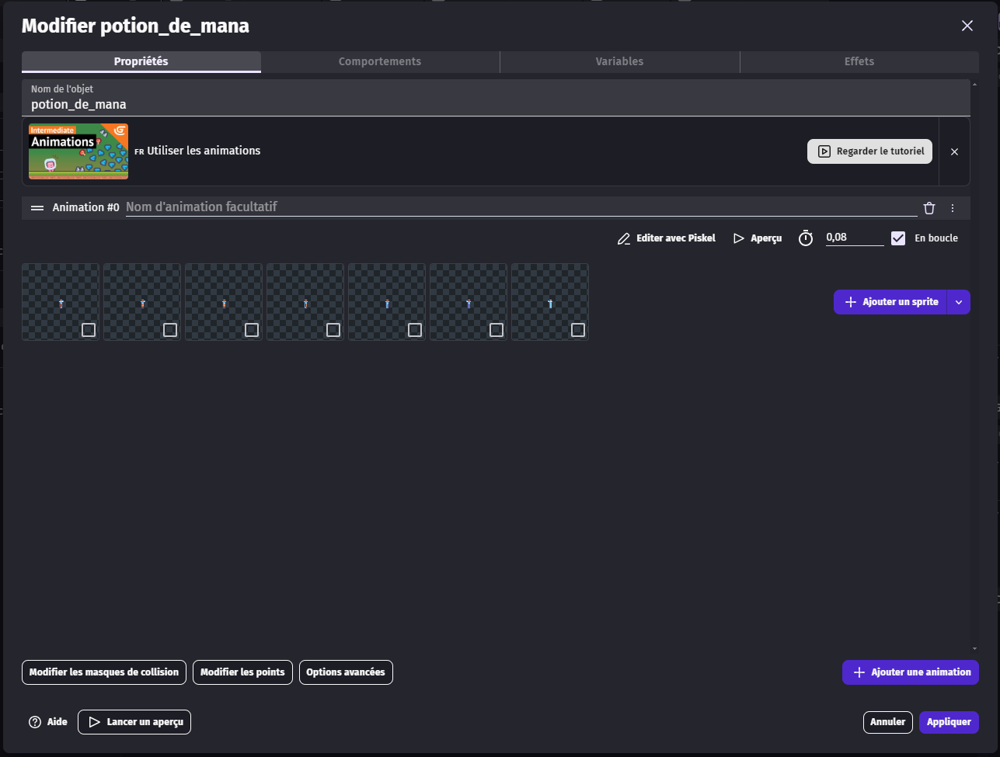

Nous allons le mettre en objet global et en placer plusieurs dans nos différents mondes.

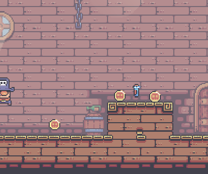

Dans les événements, nous allons ajouter une règle : si le joueur récupère cette potion, la variable globale `power` augmente. Nous allons quand même définir une limite maximale afin d'éviter d'avoir trop de `power`.

On ajoute donc un événement dans le groupe `Collectible`.

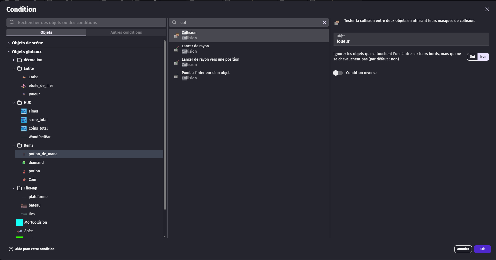

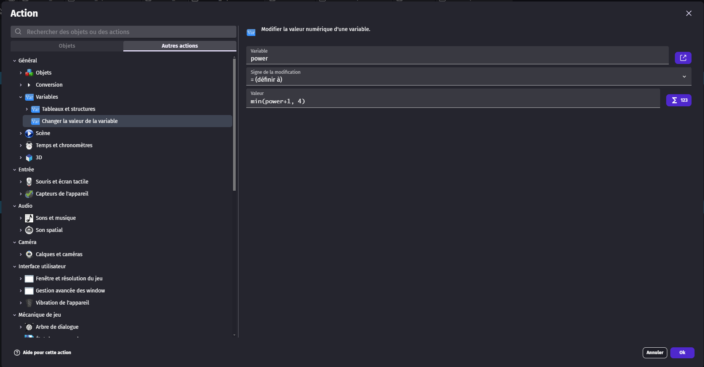

L'utilisation de `min()` permet de garder la plus petite valeur entre la nouvelle valeur de `power` (`power + 1`) et la valeur maximale. Si on dépasse la valeur maximale, qui est 4, la variable reste bloquée à 4.

On pense aussi à supprimer l'objet afin de ne pas pouvoir le ramasser en boucle.

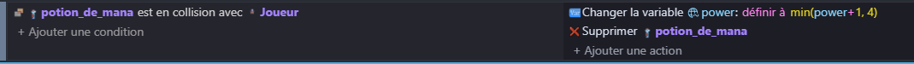

Pensez à copier-coller cet événement dans les autres niveaux.

## Lancer d'épée

Nous allons créer un nouvel objet `Sprite`, que nous mettrons en objet global. Dans cet objet, nous utiliserons simplement l'image présente dans le dossier `sword/23-sword embedded`.

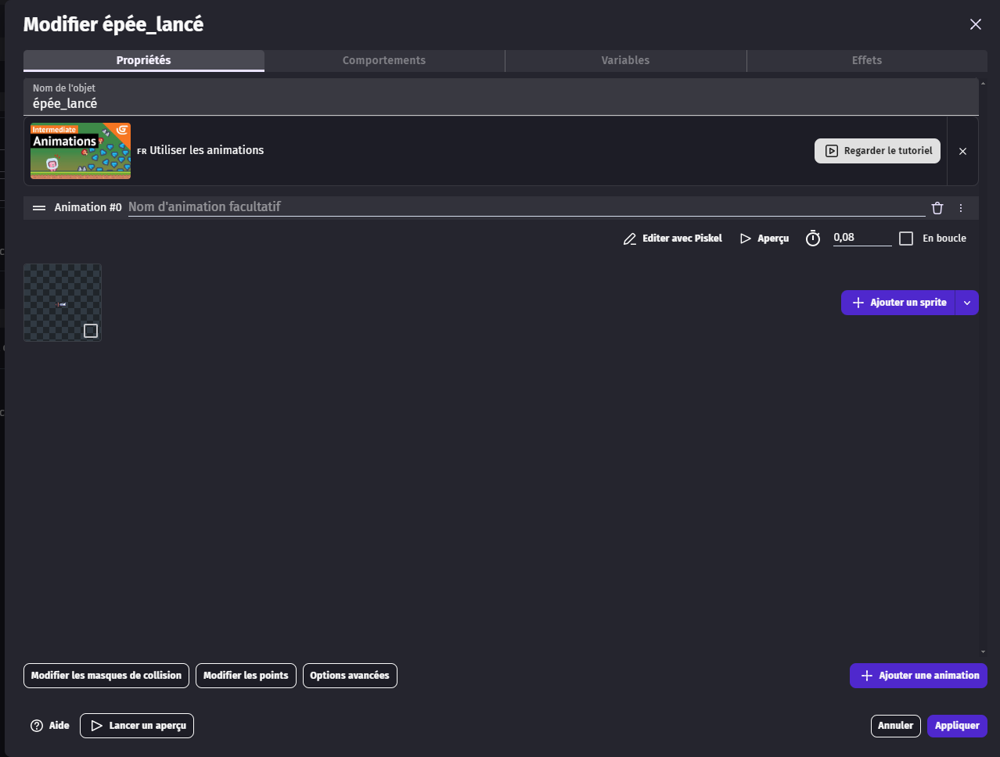

Nous allons ensuite modifier les points de l'objet pour déplacer le point d'origine au niveau du manche de l'épée.

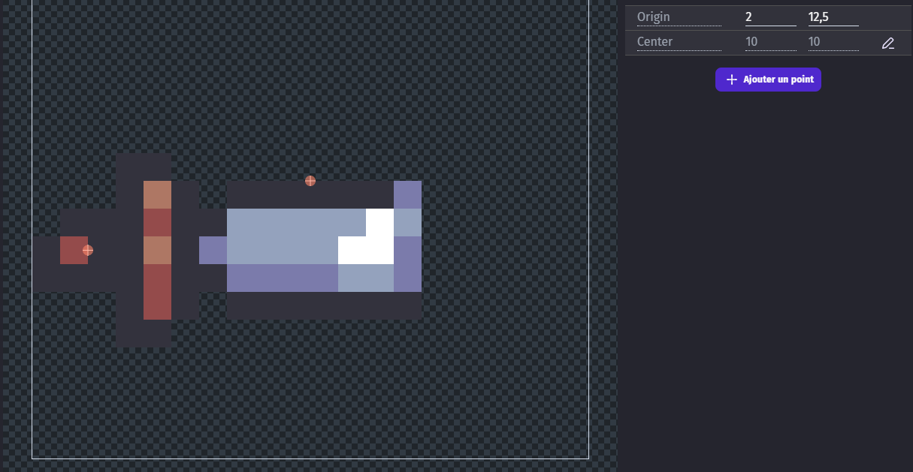

Maintenant, nous allons gérer le lancer d'épée. Pour cela, nous allons créer un nouvel événement dans le groupe du joueur, puis vérifier si une touche est pressée et si le joueur a assez de `power`.

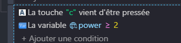

En action, nous allons retirer 2 à `power`, puis faire apparaître l'épée lancée au point `sword` du joueur.

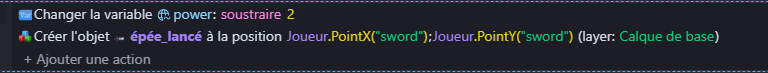

Nous allons ajouter deux événements en dessous de celui que nous venons de créer.

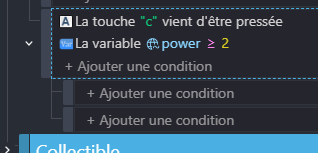

Cela permet de créer une sous-condition dans laquelle on vérifie l'orientation du joueur.

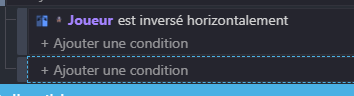

Sur le deuxième événement, faites un clic droit, puis choisissez `Remplacer`, puis `Faites-en un else pour l'événement précédent`.

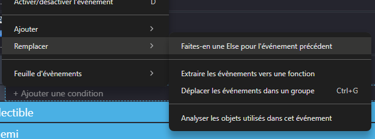

Cela donne ceci.

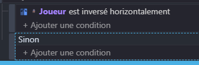

Nous pouvons maintenant ajouter des actions pour le cas inverse de l'événement précédent.

Sur le premier événement, nous retournons l'épée lancée, puis nous lui appliquons une force permanente dans la direction X négative.

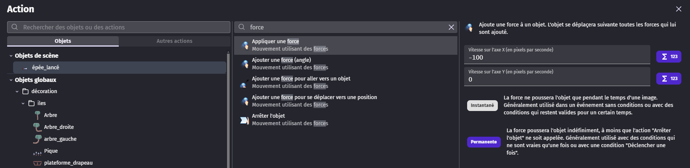

Pour l'autre événement, il suffit d'appliquer une force dans l'autre sens.

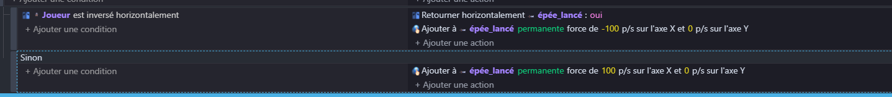

Pensez bien à mettre l'objet de l'épée dans les objets globaux et à copier-coller le code dans les autres niveaux.

Nous pouvons maintenant tester que tout fonctionne avant de passer à l'étape suivante.

## Détection des ennemis et disparition

Nous allons commencer par les ennemis. On ajoute un événement dans le groupe du joueur avec comme condition : l'épée lancée touche un ennemi du groupe `Ennemis`. Si c'est le cas, on supprime l'ennemi, on supprime l'épée lancée et on ajoute du score.

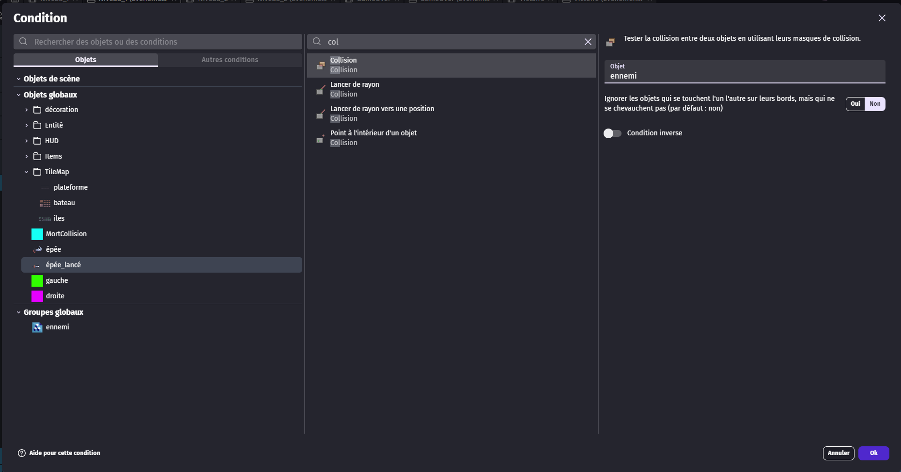

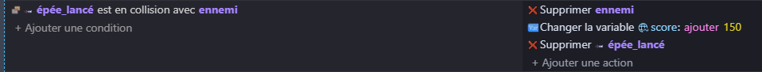

On copie-colle ensuite cet événement dans les autres niveaux.

Nous allons aussi faire disparaître l'épée lancée lorsqu'elle sort de la caméra.

Pour cela, allez dans l'objet de l'épée lancée, puis dans `Comportements`, et ajoutez le comportement `Détruire en dehors de l'écran`.

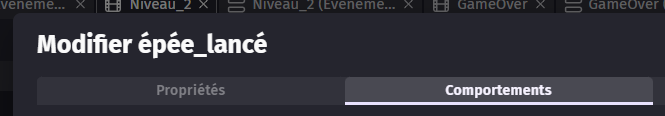
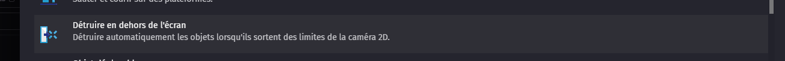

Cela permet de faire disparaître l'épée quand elle sort de l'écran.

## Affichage du power

Maintenant que le `power` est paramétré, il faut l'afficher dans le HUD. Pour cela, nous allons créer un nouvel objet `Barre de ressource` et sélectionner la barre que nous souhaitons utiliser.

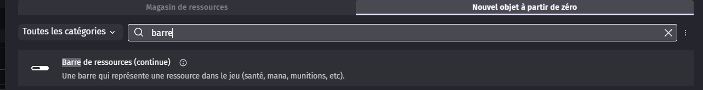

Une fois cela fait, double-cliquez sur la barre pour afficher ses paramètres, puis mettez la valeur initiale à 0 et la valeur maximale à 4.

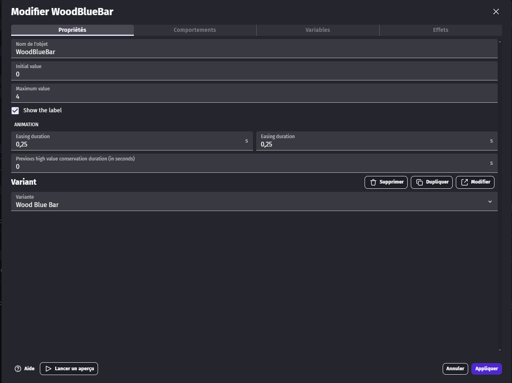

Ensuite, ajoutez la barre dans le HUD en veillant à bien sélectionner le calque `HUD`. Vous pouvez aussi placer l'objet dans la scène, puis choisir le calque `HUD` dans ses propriétés.

Vous pouvez placer la barre où vous voulez. Mettez-la ensuite dans les objets globaux afin de pouvoir la réutiliser dans tous les niveaux.

Une fois cela fait, allez dans la partie code. Dans le même événement que celui utilisé pour mettre à jour la barre de vie, ajoutez une action qui met la valeur de la barre de `power` à la valeur de la variable `power`.

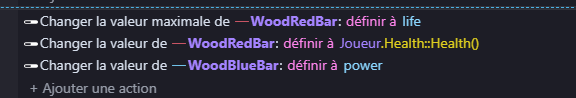
