# Niveau final

## Un grand niveau

Pour finir en beauté, nous allons créer un niveau final mêlant bateau et îles.

Pour cela, nous allons utiliser les tilemaps déjà créées, ainsi que tous les éléments de décor et les ennemis.

Dans un premier temps, nous allons créer une nouvelle scène à partir du niveau 2. Pour cela, faites un clic droit sur le niveau 2, puis choisissez `Dupliquer`.

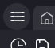
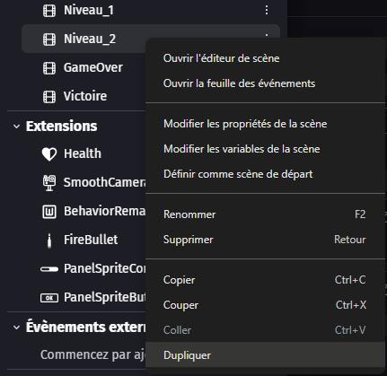

La nouvelle scène devrait automatiquement s'appeler `Niveau 3`. Si ce n'est pas le cas, il suffit de la renommer ainsi.

Cliquez ensuite dessus afin d'afficher la scène dans l'éditeur. Le fait de dupliquer la scène permet de garder tous les événements déjà créés, sans avoir besoin de les copier-coller.

Avant de faire une manipulation, vérifiez que vous êtes bien sur la scène `Niveau 3`.

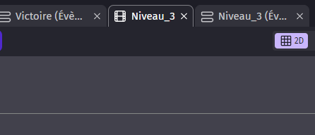

Nous allons cacher le calque `HUD`.

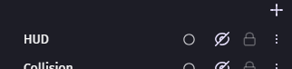

Puis cliquez au centre de l'écran et sélectionnez tous les éléments présents dans le monde.

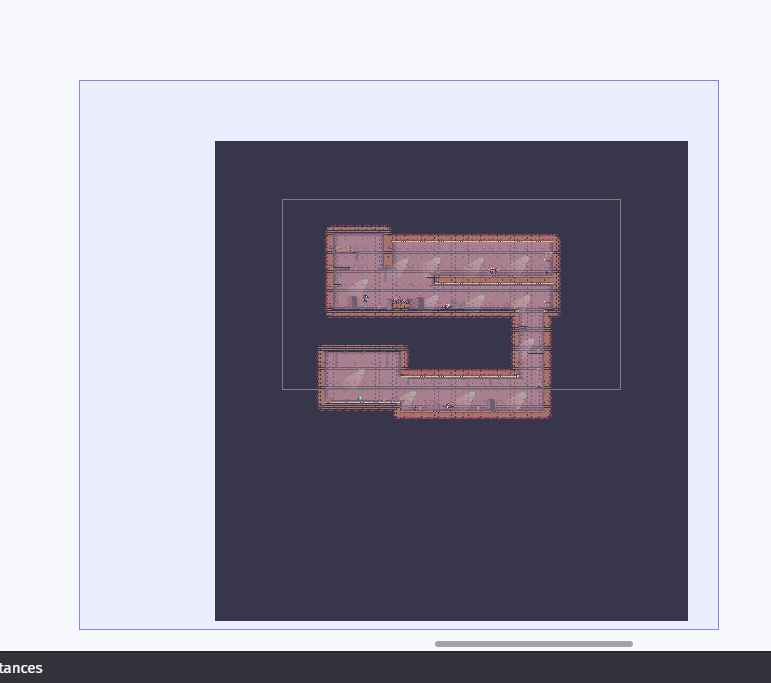

Appuyez ensuite sur la touche `Suppr` du clavier pour tout supprimer.

Une fois cela fait, nous pouvons réafficher le calque `HUD` et commencer à créer un nouveau monde.

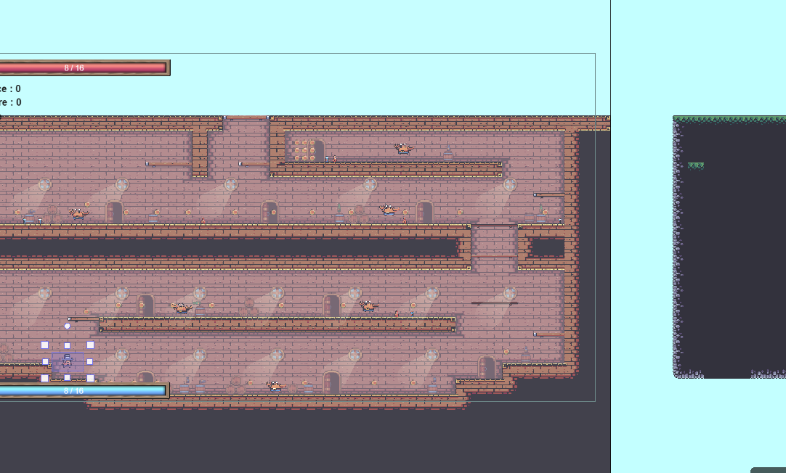

Quand le monde nous plaît, nous allons relier les différentes scènes entre elles.

Dans le niveau 2, nous allons modifier l'événement du diamant pour que le joueur parte vers le niveau 3 lorsqu'il le touche.

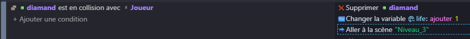

Dans le niveau 3, nous allons mettre en place l'événement suivant : quand le joueur touche le diamant, il va vers la scène de victoire.

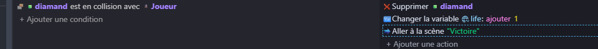

Nous allons ensuite créer la zone du boss. Il faut prévoir une zone plate afin que le boss puisse marcher dessus correctement.

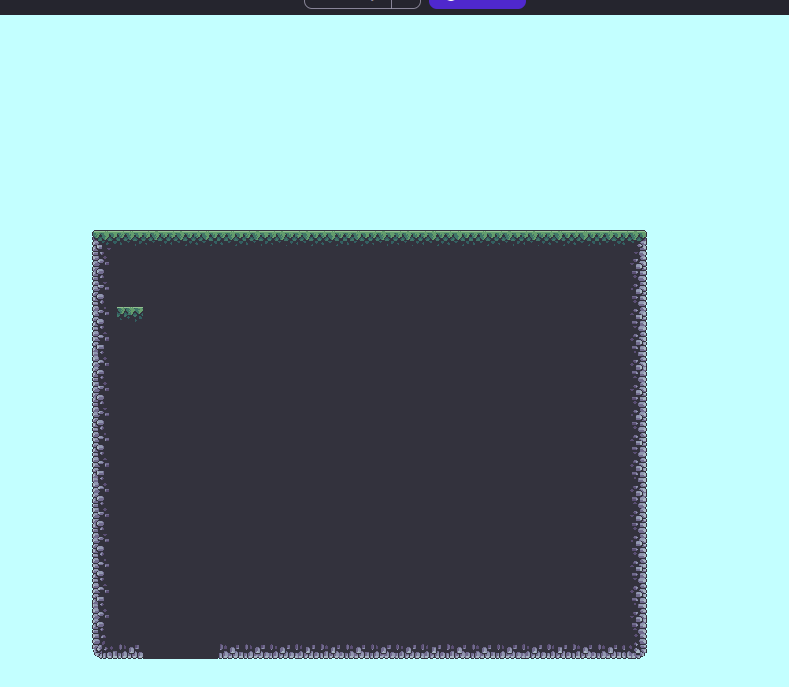

Nous allons aussi créer un objet `boss_detection`. Ce sera un collider qui permettra de détecter l'entrée du joueur dans la zone du boss.

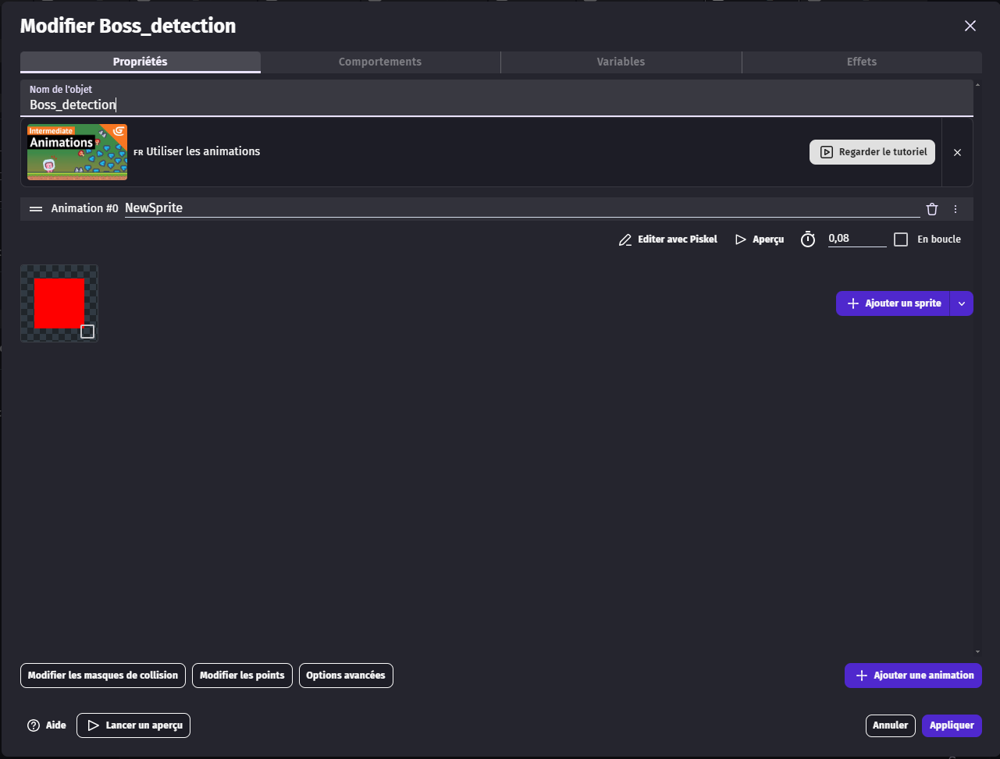

On le place ensuite à l'entrée de la zone du boss.

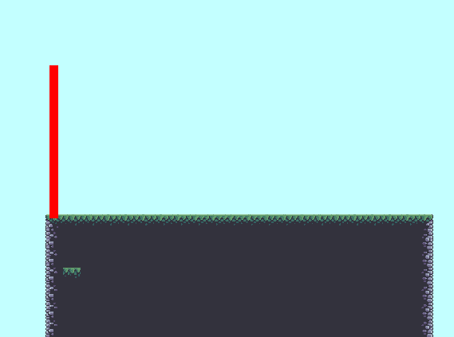
