# Boss

## ajout de l'objet

Nous allons créée un boss qui sera un requin géant, pour cela nous allons créer un nouveau objet "Sprite" qu'on
appelera "Boss"

Toute les annimation ce trouve dans le dossier "requin"

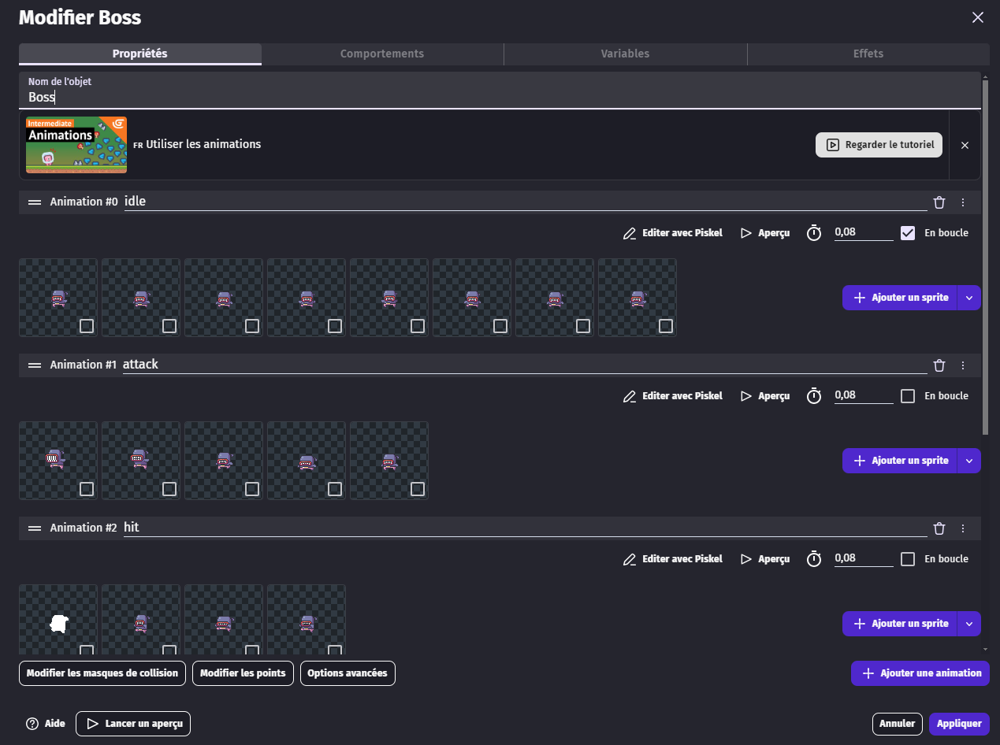

nous allons lui augmenté ça taille, en cliquant sur "Option avancé"

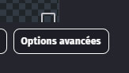
puis mettre 2 en facteur de taille
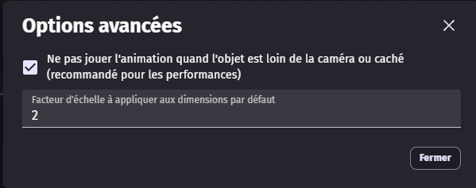

puis en comportement nous allons lui rajouté de la vie, ainsi qu'un comportement d'objet de plateforme

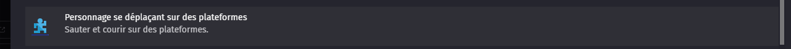
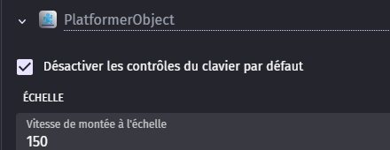

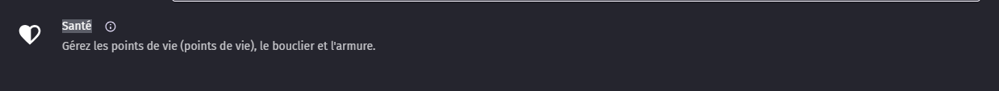

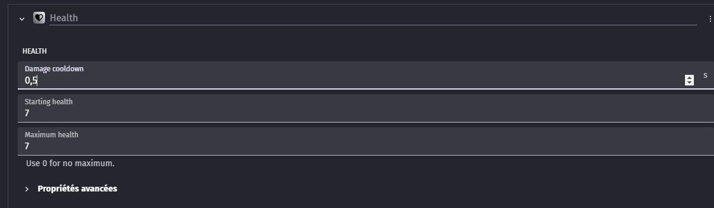

nous allons ensuite lui rajouté une variable

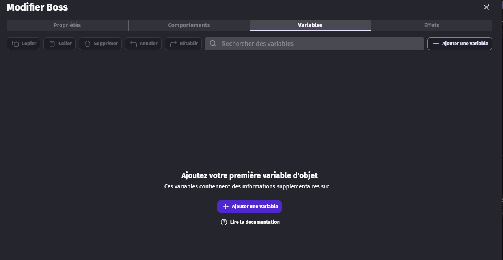

qu'on appellera "Active" et qui sera en boolean (vrai ou faux) et en faux de base

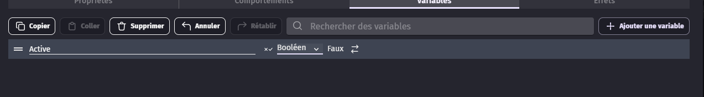

## événement

Cette fois ci, nous allons utilisé toute les animations

en premier nous allons créée un groupe d'événement qu'on vas appeler "Boss"

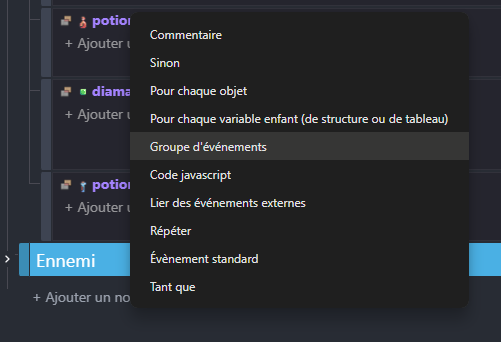
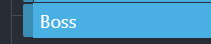

et dedans nous allons y mettre des événements

Le premier événement est que, si le joueur rentre dans la zone de detection du boss, et ce une seul fois, alors on vas
changé la variable "Active" du boss a "vrai"

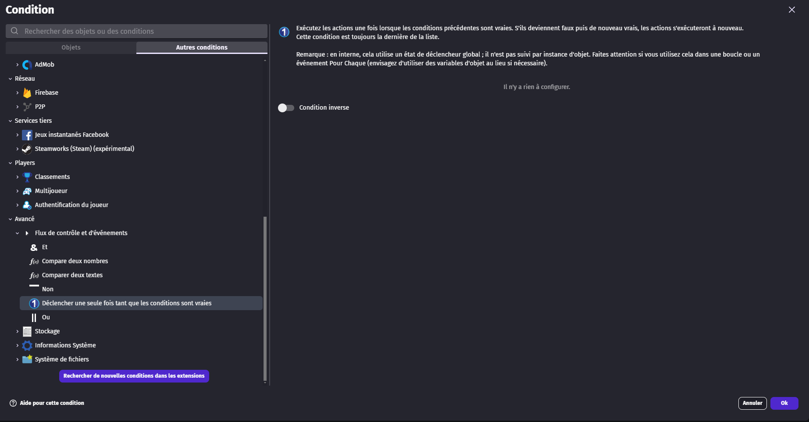
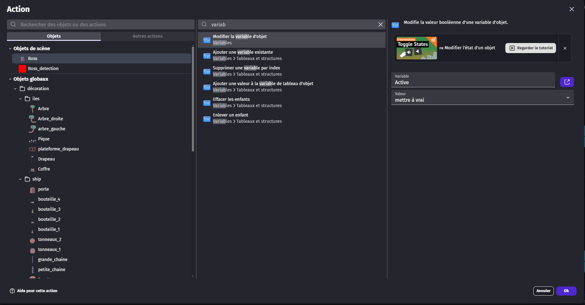
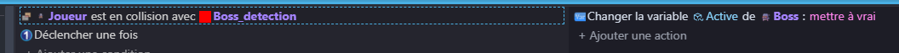

le second événement est que, si le boss est en active, et en vie, alors il vas se raproché du joueur mais uniquement sur
l'axe "x"

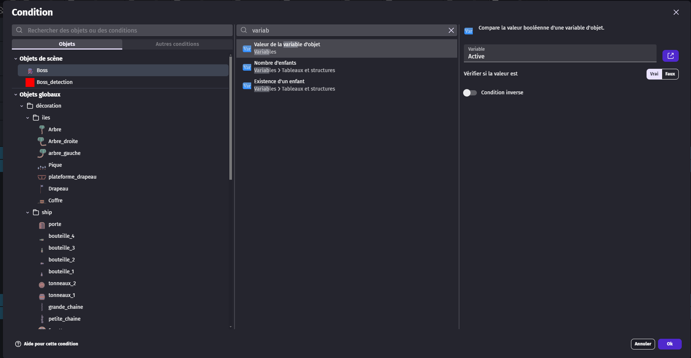
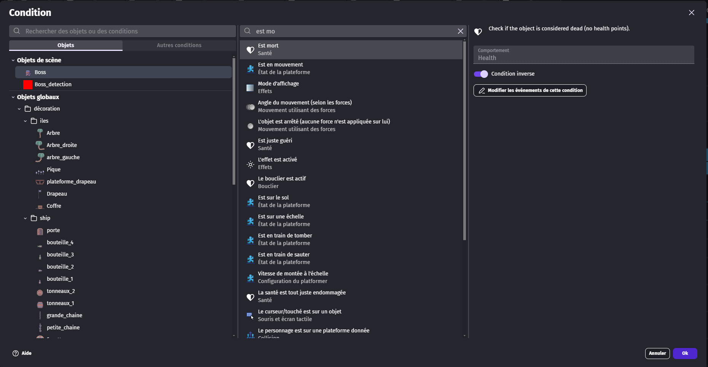

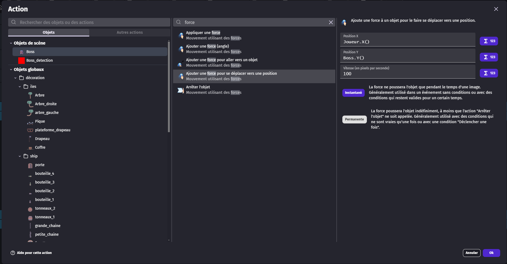

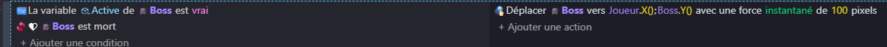

nous allons rajouté ensuite 2 autre événement qui permettron de retourné le boss afin qu'il regarde toujours dans la bonne direction

pour cela nous allons prendre la condition "comparer deux nombre" et comparé la différence entre la position du joueur et la position du boss, si il est positif (supérieur a 0) alors le joueur se trouve sur la droite du boss, si il est négatif (inférieur a 0) alors le joueur se trouve sur la gauche du boss
on fait ça pour les deux événement

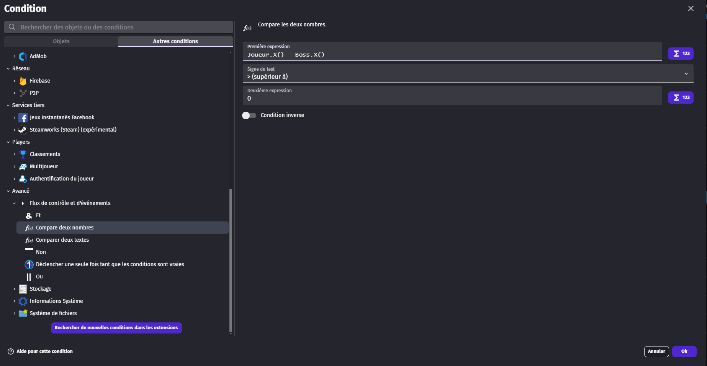
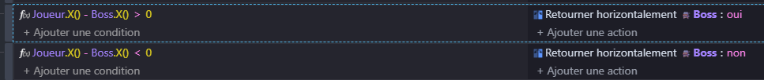

Ensuite nous allons mettre en place les dégat du joueur
il y aura plusieurs événement lier à cela

les deux premier son pour la detection des épée sur le boss, on vérifie si l'épée rentre en collision avec le boss et si c'est le cas on retire de la vie au boss et on suprimme l'épée lancé

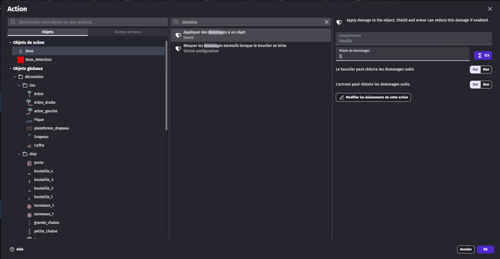
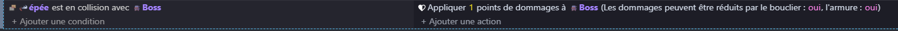

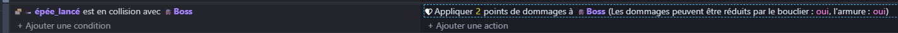

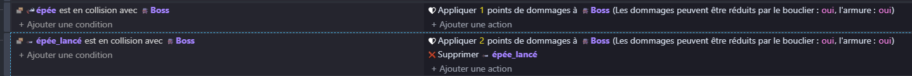

Nous allons rajouté 4 autre événement qui son pour les animations

Le premier est pour activé l'animation de dégat a condition que le joueur ne sois pas mort et qu'il ai pris des dégat
il faut bien activé la "condition inverse"

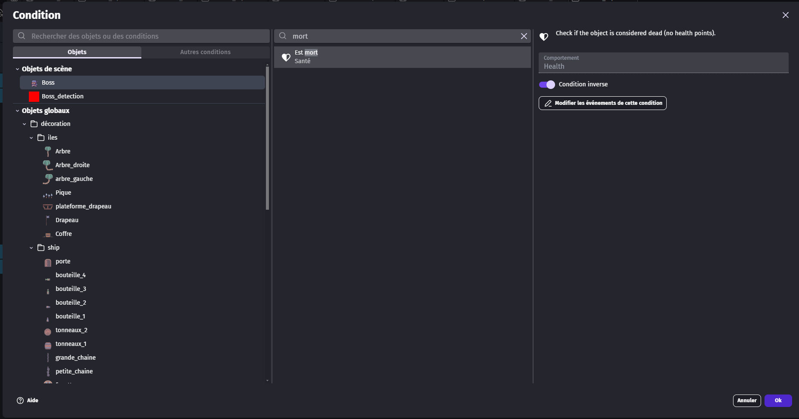

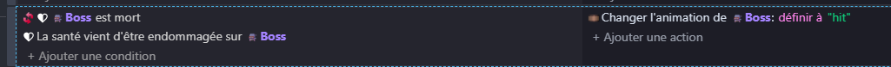

ensuite c'est la même chose mais si le joueur est mort, on vas jouer une autre animation

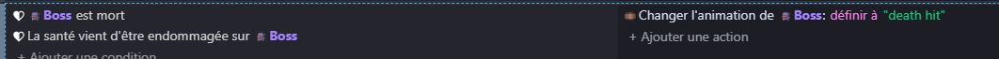

ensuite nous allons vérifier que l'animation est fini et que c'est l'animation "hit" et si c'est le cas, nous allons
relancé l'animation d'idle

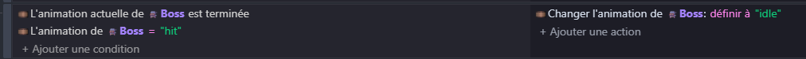

et nous faisons pareil pour le dernière événement, mais avec l'animation "death"

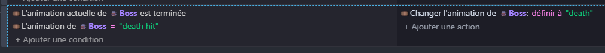

voici au globale se que nous avons

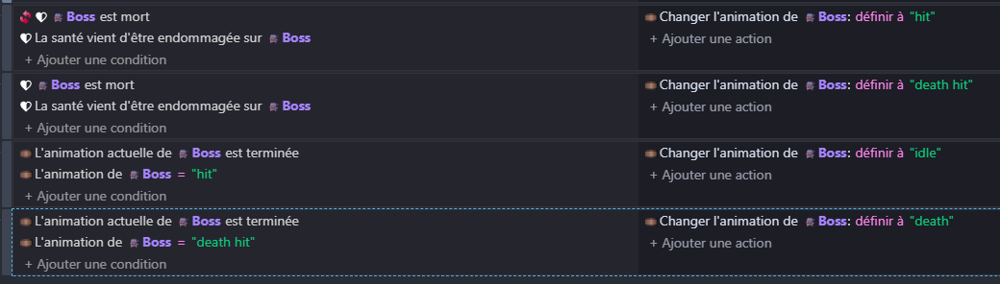

Maintenent il ne nous reste plus qu'a faire en sorte que quand le boss attaque le joueur, que cela retire 1 point de vie
au joueur et que ça joue l'animation d'attaque

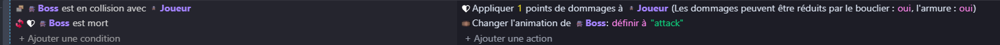

## fin du niveau

maintenent que le boss est mort, nous allons faire apparaitre le diamant sur lui, pour cela nous allons rajouté un
événement, dans lequel nous allons vérifier que l'animation de mort est terminé, et si c'est le cas faire apparaitre un
diamant

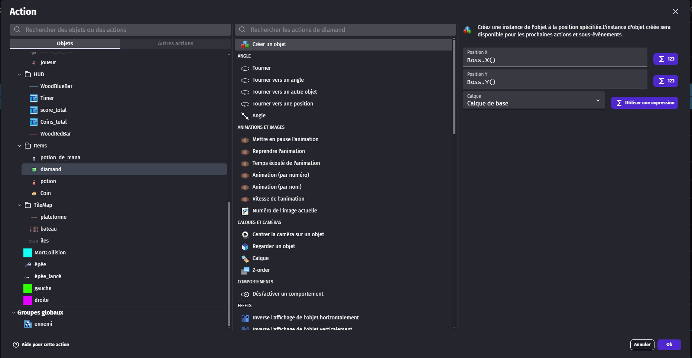

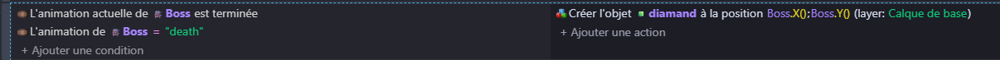

