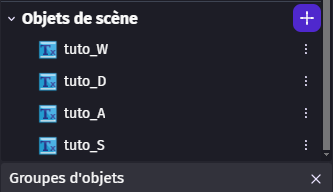
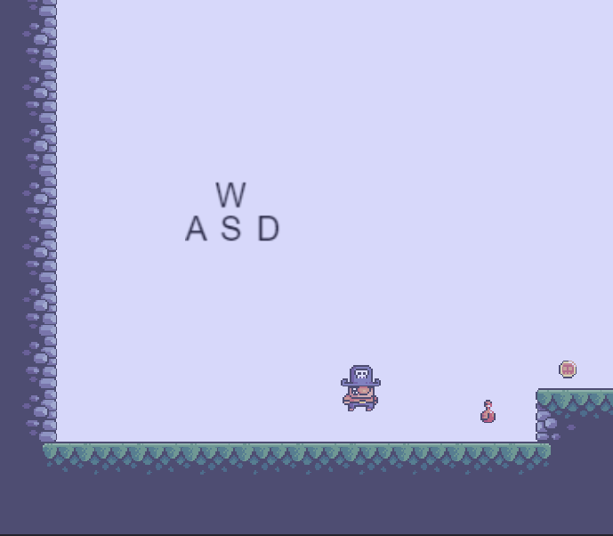
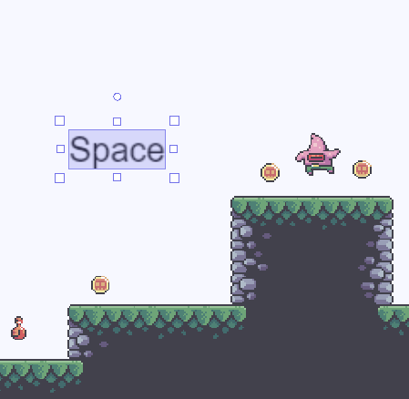
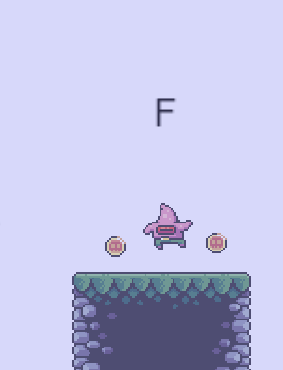
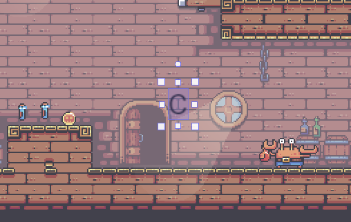

# Tutoriel

Maintenant que les mondes et le boss sont terminés, nous allons ajouter des indications dans les niveaux 1 et 2 afin que le joueur sache comment se déplacer et comment utiliser ses capacités.

## Le monde 1

On commence par le monde 1. Nous allons ajouter des objets `Texte` pour afficher les touches de déplacement.

Pour cela, créez quatre objets `Texte` et écrivez les touches utilisées afin d'obtenir ceci.

Bien sûr, il faut changer le nom et le texte selon les touches que vous avez attribuées.

On ajoute aussi la touche de saut.

Il faut faire la même chose devant le premier ennemi.

## Le monde 2

Dans le niveau 2, nous allons faire la même chose pour expliquer la touche du pouvoir. Le mieux est de placer deux potions de mana, puis d'ajouter la touche juste après, afin de montrer qu'une action est possible.

